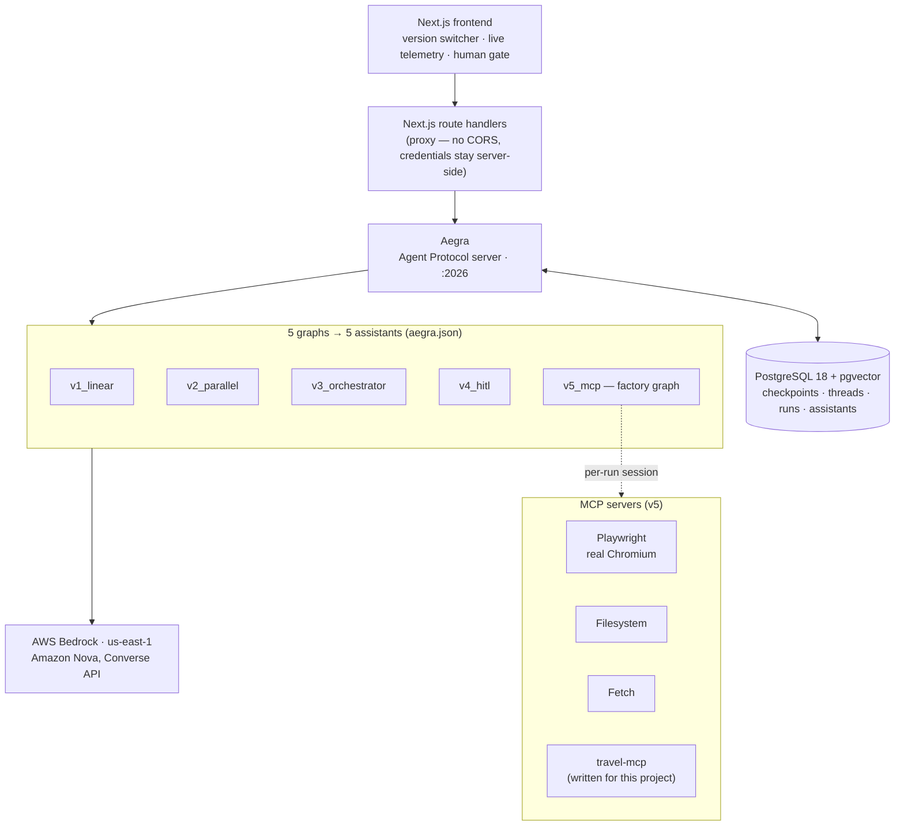
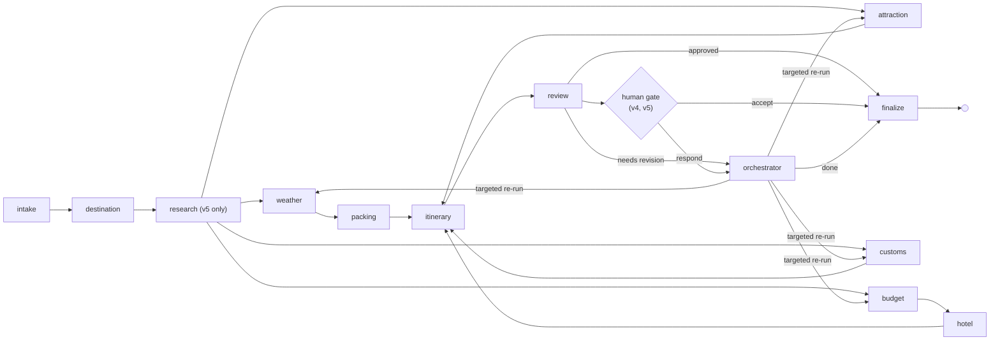
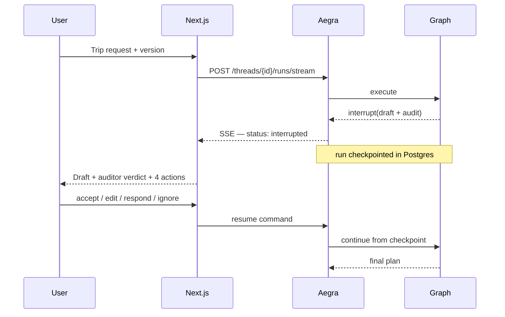

# Travel Planner Agent

**Five generations of the same multi-agent travel planner — linear, parallel, orchestrated, human-in-the-loop, and browser-automating — running side by side behind one [Aegra](https://github.com/ibbybuilds/aegra) server, switchable at runtime.**

`langgraph` · `aegra` · `agent-protocol` · `amazon-bedrock` · `amazon-nova` · `mcp` · `playwright` · `human-in-the-loop` · `nextjs` · `multi-agent` · `postgres`

---

## Why this exists

Most agent demos show you one architecture and assert it is the right one. This
one ships **five**, each a working system, each adding exactly one capability to
the last — so the trade-offs are visible rather than claimed. Run the same
request through all five and watch what parallelism actually buys, what an
orchestrator actually fixes, and what real browsing actually costs.

All five are registered as separate graphs with a single Aegra server, so
switching version at runtime is one field in an API call — not a redeploy.

## The five versions

| Version | Architecture | Adds | Agents |
|---|---|---|---|
| **v1** `v1_linear` | Fixed sequential chain | Baseline: shared state, Bedrock, streaming, checkpointing | 2 |
| **v2** `v2_parallel` | Fan-out / fan-in DAG | Concurrent branches, reducer-based state merging | 6 |
| **v3** `v3_orchestrator` | Fan-out + LLM orchestrator | Self-audit loop, targeted re-runs, bounded iteration | 10 |
| **v4** `v4_hitl` | v3 + `interrupt()` gate | Accept / edit / respond / ignore, resume from checkpoint | 10 |
| **v5** `v5_mcp` | v4 + 4 MCP servers | Real browser automation, per-run MCP session lifecycle | 10 |

### Measured, not estimated

Real runs against Amazon Nova on Bedrock, through the running Aegra server:

| Version | Wall clock | Agent time | Agent calls | Tokens |
|---|---|---|---|---|
| v1 | 7.1s | 7.0s | 2 | 2,656 |
| v2 | 8.8s | 12.9s | 6 | 8,921 |
| v3 | 11.9s | 17.8s | 9 | 14,376 |
| v5 | 21.9s | 18.7s | 9 | 24,692 |

v2 and v3 run **more agent-seconds than wall-clock seconds** — that difference
is the parallel fan-out, 4.1s and 5.9s of it respectively. v5 inverts the
relationship: its wall clock exceeds its agent time because real browsing is not
model time.

Across every live run above: **zero structured-output repairs and zero tier
escalations.**

## Architecture



**How a request flows.** The frontend picks a version, which selects an
`assistant_id`. Next.js route handlers proxy to Aegra so no credential reaches
the browser. Aegra persists the run, executes the corresponding LangGraph graph,
and streams events back as SSE. State is checkpointed to PostgreSQL after every
node, which is what makes v4's mid-run pause survivable: the human can walk
away, and the run resumes from the exact checkpoint when they answer. v5's graph
is built per request by a factory, so its MCP browser sessions belong to the run
rather than being shared across concurrent ones.

## v3–v5: the orchestrated revision loop



The **Review** agent audits the assembled draft and the **Orchestrator** turns
that audit into a decision naming only the specialists whose output must change.
Asked for *"fewer temples on day 2, add a food market, lower the hotel tier"*, it
re-ran exactly `attraction`, `hotel`, `budget` and `itinerary` — and nothing
else.

## Human-in-the-loop



Nothing before the gate re-executes on resume — verified: the itinerary agent
runs once across a pause-and-accept cycle.

## Tech stack

| Layer | Technology | Notes |
|---|---|---|
| Orchestration | LangGraph 1.2 | Five topologies over one state schema |
| Serving | Aegra 0.10 (Agent Protocol) | Native process, no Docker required |
| Models | AWS Bedrock — Amazon Nova Pro / Lite / Micro | Tiered by agent role; Llama 3.3 70B as fallback |
| Persistence | PostgreSQL 18 + pgvector | Aegra owns checkpoints, threads, runs, assistants |
| Tools | MCP — Playwright, Filesystem, Fetch, `travel-mcp` | `travel-mcp` written for this project |
| Frontend | Next.js 16, React 19, Tailwind 4 | SSE streaming, no CORS |
| Testing | pytest — 293 tests | Plus a live suite that is opt-in |

### Model tiering

| Tier | Model | Agents | Why |
|---|---|---|---|
| high | `us.amazon.nova-pro-v1:0` | orchestrator, review, itinerary | Routing decisions, auditing, multi-day synthesis |
| mid | `us.amazon.nova-lite-v1:0` | destination, hotel, attraction, budget | Moderate reasoning with structured output |
| low | `us.amazon.nova-micro-v1:0` | weather, packing, customs | Extraction-shaped; text-only is enough |
| fallback | `us.meta.llama3-3-70b-instruct-v1:0` | any agent that needs it | Cross-family escape hatch, per agent |

Model IDs are resolved from the account and smoke-tested rather than hardcoded —
several Bedrock models reject their own base ID and require a cross-region
inference profile instead. `scripts/resolve_bedrock_models.sh` reproduces it.

## Getting started

**Prerequisites:** Python 3.12+, [uv](https://docs.astral.sh/uv/), Node 20+,
PostgreSQL 18 with pgvector, and AWS credentials with Bedrock access in
`us-east-1`.

```bash
git clone https://github.com/adarshcod30/Travel-Planner-Agent.git
cd Travel-Planner-Agent

# 1. Python deps (creates .venv)
uv sync --extra dev --extra server --extra mcp

# 2. Configure — add your AWS keys or set AWS_PROFILE
cp .env.example .env

# 3. PostgreSQL + pgvector (idempotent; installs nothing)
brew install postgresql@18 pgvector      # macOS; apt equivalents on Linux
./scripts/bootstrap_postgres.sh

# 4. Chromium for the v5 browser automation
npx playwright install chromium

# 5. Start Aegra — migrations run automatically
./scripts/run_aegra.sh
```

Then, in a second terminal:

```bash
cd frontend
npm install
cp .env.local.example .env.local
npm run dev
```

Open <http://localhost:3000>. Verify the backend on its own with:

```bash
curl http://localhost:2026/health/deep
```

## Testing

```bash
uv run pytest -m "not live"     # 293 tests, no credentials, no network
uv run pytest -m live           # real Bedrock calls — costs money
```

The live suite is a **structured-output conformance check**: it asserts that
each schema parses on the tier it was assigned, and fails if an agent only
succeeded because the escalation safety net caught it.

## Project structure

```
├── aegra.json                    5 graphs → 5 assistants; auth; custom routes
├── src/travel_planner/
│   ├── core/                     state schema, Bedrock tiering, config, logging
│   ├── agents/                   10 specialists — a constant across all versions
│   ├── prompts/                  one system prompt per agent
│   ├── tools/mcp/                MCP client, browser chain, research node
│   ├── versions/                 v1…v5 — the topologies
│   ├── auth/                     Aegra auth + ownership handlers
│   └── routes/                   /versions, /agents, /health/deep
├── mcp-servers/travel-mcp/       standalone MCP server, 5 tools
├── frontend/                     Next.js — planner + comparison
├── scripts/                      postgres bootstrap, aegra runner, model resolver
├── tests/                        unit + opt-in live suites
└── docs/                         architecture, versions, deployment, models
```

## Documentation

| Document | Contents |
|---|---|
| [ARCHITECTURE.md](docs/ARCHITECTURE.md) | How the pieces fit, and the decisions behind them |
| [VERSIONS.md](docs/VERSIONS.md) | What each version adds and why |
| [AEGRA_DEPLOYMENT.md](docs/AEGRA_DEPLOYMENT.md) | Native, no-Docker deployment runbook |
| [MODELS.md](docs/MODELS.md) | Tiering, structured-output resilience, cost |
| [DEVELOPMENT_PLAN.md](docs/DEVELOPMENT_PLAN.md) | The plan this was built against |
| [travel-mcp](mcp-servers/travel-mcp/README.md) | The custom MCP server |

## Safety boundary

v5 drives a real browser to search real availability and prices, and reports
what it finds. It never enters payment details and never clicks a final purchase
button, under any configuration. That is a deliberate boundary, not an
unimplemented feature.

## License

MIT
