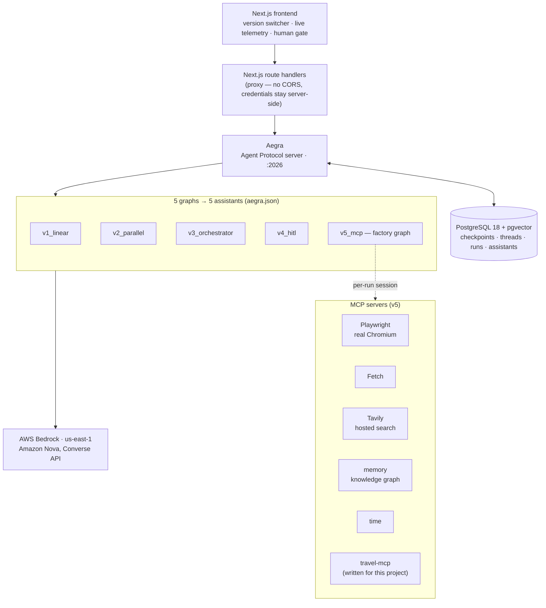
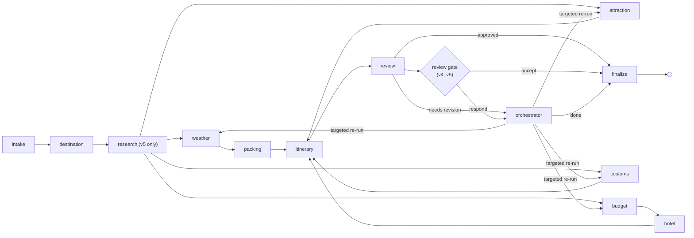
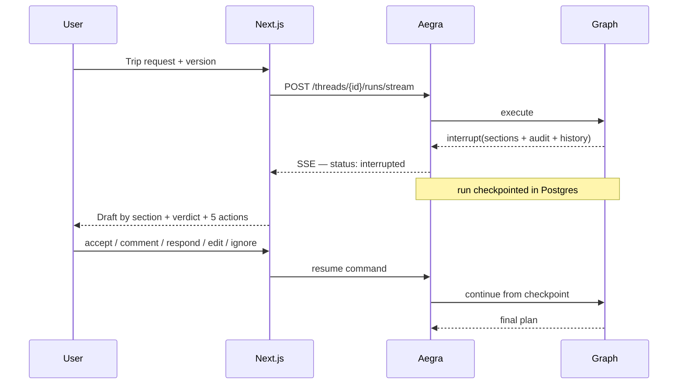

# Travel Planner Agent

**Five generations of the same multi-agent travel planner — linear, parallel, orchestrated, collaborative, and browser-driving — running side by side behind one [Aegra](https://github.com/ibbybuilds/aegra) server, switchable at runtime.** Plans trips from India, priced in rupees. Watch v5 browse in real time and take the browser off it when a site wants a login.

`langgraph` · `aegra` · `agent-protocol` · `amazon-bedrock` · `amazon-nova` · `mcp` · `playwright` · `human-in-the-loop` · `browser-automation` · `nextjs` · `multi-agent` · `postgres`

---

## Why this exists

Most agent demos show you one architecture and assert it is the right one. This
one ships **five**, each a working system, each adding exactly one capability to
the last — so the trade-offs are visible rather than claimed. Run the same
request through all five and watch what parallelism actually buys, what an
orchestrator actually fixes, and what real browsing actually costs.

All five are registered as separate graphs with a single Aegra server, so
switching version at runtime is one field in an API call — not a redeploy.

## The five versions

| Version | Architecture | Adds | Agents |
|---|---|---|---|
| **v1** `v1_linear` | One model call | The baseline: what a good model does entirely unaided. Runs on the *highest* tier deliberately, so later gains cannot be dismissed as v1 being handicapped | 1 |
| **v2** `v2_parallel` | Fan-out / fan-in DAG | Concurrent branches, reducer-merged state, and reference data — station codes, GST slabs, festival dates, live exchange rates | 6 |
| **v3** `v3_orchestrator` | + reviewer and orchestrator | A self-audit loop with targeted re-runs and a bounded iteration count — and memory, so the second trip starts better than the first | 10 |
| **v4** `v4_hitl` | + section-level review | The plan arrives as sections you mark up. A comment pinned to one routes to its specialist with **no orchestrator call** | 10 |
| **v5** `v5_mcp` | + six MCP servers | A real browser you watch working, can take over mid-run, and which opens real booking pages | 10 |

Every version is cumulative: v5 is v1 with four more ideas in it. Running the
same trip through two of them shows what the idea bought.

### Measured, not estimated

Real runs against Amazon Nova on Bedrock, through the running Aegra server:

One request — *"forts and street food, reachable by train"*, from Delhi, three
days, two travellers — through all five, against Amazon Nova on Bedrock:

| Version | Wall clock | Agent time | Agent calls | Tokens | Budget produced |
|---|---|---|---|---|---|
| v1 | 6.0s | 4.3s | 1 | 2,057 | a range, not a figure |
| v2 | 10.0s | 11.5s | 6 | 14,214 | ₹35,600 |
| v3 | 32.1s | 33.7s | 14 | 39,696 | ₹30,140 |
| v4 | 20.1s | 18.1s | 9 | 24,026 | ₹37,000 |
| v5 | 26.1s | 18.8s | 9 | 31,487 | ₹36,200 |

Three things in that table are the whole argument.

**v2 runs more agent-seconds than wall-clock seconds.** That gap is the fan-out
doing its job — four specialists in the time of the slowest one.

**v3 cost 14 calls where v4 cost 9**, for the same request. Its reviewer
rejected the first draft and its orchestrator inferred what to re-run from
prose. v4 does not have to infer: you point at the section, and the specialist
behind it is a dictionary lookup.

**v5 inverts the ratio the other way** — 26.1s wall against 18.8s of agent time,
because real browsing is not model time.

v1 does not produce a budget at all. It has no research, so it gives a cost
range and states what to verify before booking, which is the honest output for
a model working from recall.

## Architecture



**How a request flows.** The frontend picks a version, which selects an
`assistant_id`. Next.js route handlers proxy to Aegra so no credential reaches
the browser. Aegra persists the run, executes the corresponding LangGraph graph,
and streams events back as SSE. State is checkpointed to PostgreSQL after every
node, which is what makes v4's mid-run pause survivable: the human can walk
away, and the run resumes from the exact checkpoint when they answer. v5's graph
is built per request by a factory, so its MCP browser sessions belong to the run
rather than being shared across concurrent ones.

## v3–v5: the orchestrated revision loop



The **Review** agent audits the assembled draft and the **Orchestrator** turns
that audit into a decision naming only the specialists whose output must change.
Asked for *"fewer temples on day 2, add a food market, lower the hotel tier"*, it
re-ran exactly `attraction`, `hotel`, `budget` and `itinerary` — and nothing
else.

## Human-in-the-loop



Nothing before the gate re-executes on resume — verified: the itinerary agent
runs once across a pause-and-accept cycle.

## Watching v5 work, and taking the browser from it

v5 opens a real Chromium and you watch it: every navigation, refusal and click
arrives as an event, and every action captures a screenshot, streamed over the
same SSE connection as the state. Nothing is reconstructed afterwards — what you
see is the page as it was when the run made its decision about it.

When a site wants a login, the run **stops and offers you the browser**. Clicking
the screenshot clicks the page; there is a control bar for typing, Enter, Tab,
scrolling and Back; and the run continues when you say you are done.

### Why a handover cannot use `interrupt()`

This is the one architectural idea worth reading the code for. v4's plan review
uses `interrupt()`: LangGraph checkpoints the state, the run *stops*, and the
answer can come days later. A browser handover cannot work that way, because
`interrupt()` unwinds the node — and the node is holding a live Chromium with a
half-finished login in it. Unwinding closes the very thing you were about to
take over.

```
v4 review    →  interrupt()      →  run stops, state persists, no browser involved
v5 handover  →  blocking queue   →  run continues, because the browser must
```

So the node stays running and blocks on a queue, executing what you send against
the session it is still holding. Two consequences follow, both deliberate: it is
**time-bounded**, because a blocked node holds one of very few browser slots;
and the queue is **in-process**, because routing a click to a worker that does
not hold the Chromium would accomplish nothing.

### Booking

Once a plan is approved, v5 offers to open real booking pages for it — with the
destination, dates and traveller count already filled in. Commercial travel
sites refuse automated browsers as a matter of course, and here that is the
feature rather than the failure: the browser is already on the right search, so
a refusal becomes the moment to hand it to you.

**Automation stops at payment, always.** Card, UPI and net-banking details are
not something this system types, under any configuration. A page asking for them
ends the automated part rather than being driven through.

## Tech stack

| Layer | Technology | Notes |
|---|---|---|
| Orchestration | LangGraph 1.2 | Five topologies over one state schema |
| Serving | Aegra 0.10 (Agent Protocol) | Native process, no Docker required |
| Models | AWS Bedrock — Amazon Nova Pro / Lite / Micro | Tiered by agent role; Llama 3.3 70B as fallback |
| Persistence | PostgreSQL 18 + pgvector | Aegra owns checkpoints, threads, runs, assistants |
| Tools | MCP — Playwright, Fetch, Tavily, memory, time, `travel-mcp` | `travel-mcp` written for this project; 32 Indian cities, rail fares, GST slabs, festivals |
| Frontend | Next.js 16, React 19, Tailwind 4 | SSE streaming, no CORS, print-to-PDF export |
| Deployment | systemd, PostgreSQL, no Docker | One host, one exposed port |
| Testing | pytest — 532 tests | Plus a live suite that is opt-in |

### Model tiering

| Tier | Model | Agents | Why |
|---|---|---|---|
| high | `us.amazon.nova-pro-v1:0` | orchestrator, review, itinerary | Routing decisions, auditing, multi-day synthesis |
| mid | `us.amazon.nova-lite-v1:0` | destination, hotel, attraction, budget | Moderate reasoning with structured output |
| low | `us.amazon.nova-micro-v1:0` | weather, packing, customs | Extraction-shaped; text-only is enough |
| fallback | `us.meta.llama3-3-70b-instruct-v1:0` | any agent that needs it | Cross-family escape hatch, per agent |

Model IDs are resolved from the account and smoke-tested rather than hardcoded —
several Bedrock models reject their own base ID and require a cross-region
inference profile instead. `scripts/resolve_bedrock_models.sh` reproduces it.

## Getting started

**Prerequisites:** Python 3.12+, [uv](https://docs.astral.sh/uv/), Node 20+,
PostgreSQL 18 with pgvector, and AWS credentials with Bedrock access in
`us-east-1`.

```bash
git clone https://github.com/adarshcod30/Travel-Planner-Agent.git
cd Travel-Planner-Agent

# 1. Python deps (creates .venv)
uv sync --extra dev --extra server --extra mcp

# 2. Configure — add your AWS keys or set AWS_PROFILE
cp .env.example .env

# 3. PostgreSQL + pgvector (idempotent; installs nothing)
brew install postgresql@18 pgvector      # macOS; apt equivalents on Linux
./scripts/bootstrap_postgres.sh

# 4. Chromium for the v5 browser automation
npx playwright install chromium

# 5. Check the host can actually run it (read-only; spends nothing)
./scripts/preflight.sh

# 6. Start Aegra — migrations run automatically
./scripts/run_aegra.sh
```

Then, in a second terminal:

```bash
cd frontend
npm install
cp .env.local.example .env.local
npm run dev
```

Open <http://localhost:3000>. Verify the backend on its own with:

```bash
curl http://localhost:2026/health/deep
```

## Letting other people use it

```bash
./scripts/run_aegra.sh        # terminal 1
./scripts/serve_lan.sh        # terminal 2 — prints the shareable URL
```

The script prints two addresses. Prefer the `.local` one:

```
http://Adarshs-MacBook-Air.local:3000   ← survives moving to another network
http://172.22.197.13:3000               ← only valid on the current network
```

macOS publishes that name over Bonjour, so it re-points itself when DHCP hands
you a different address — the link you shared keeps working after you move.
Other Macs and most Linux resolve it out of the box; Windows 10+ generally does,
older Windows needs Bonjour installed. If it fails for someone, fall back to the
IP.

**Only the frontend is exposed.** Aegra and PostgreSQL stay bound to loopback,
because the browser never talks to Aegra — it calls `/api/aegra/...` on the
Next.js origin and a server-side route handler forwards it. Your agent server,
your database and your AWS credentials stay on localhost no matter who has the
link. One port out, not three.

Two things to know before sharing:

- **There is no sign-in.** Anyone who opens the link can run the planner, and
  every run spends from your AWS account. Share it on a network you trust.
- **macOS will ask once** whether `node` may accept incoming connections. Allow
  it, or the port stays unreachable from other machines. Guest Wi-Fi that
  isolates clients blocks this regardless of any setting.
- **Moving networks needs no restart.** The server is bound to `0.0.0.0`, so it
  keeps serving on whatever address the machine picks up. Only the link changes
  — and not even that, if you shared the `.local` name.

### Sharing it beyond the LAN

```bash
./scripts/run_aegra.sh        # terminal 1
./scripts/serve_public.sh     # terminal 2 — prints a public URL and an access code
```

This opens a Cloudflare quick tunnel: a public HTTPS URL that works from
anywhere, with no router configuration and no inbound port. The tunnel dials
*out* to Cloudflare, so NAT, client-isolated Wi-Fi and corporate firewalls stop
mattering.

**An access code is mandatory here, not optional.** A public URL with no
sign-in spends your AWS account for anyone who finds it, and quick-tunnel
hostnames do get scanned. The script generates a four-word code unless you set
`APP_ACCESS_CODE` yourself, and gates every route: pages redirect to a prompt,
and `/api/aegra/*` returns 401 — so the model is never reached without it. The
gate is off entirely when `APP_ACCESS_CODE` is unset, so local development and
trusted-LAN sharing are unaffected.

Ctrl-C closes the tunnel and the URL dies with it. For anything lasting, deploy
properly: [AEGRA_DEPLOYMENT.md](docs/AEGRA_DEPLOYMENT.md).

## Testing

```bash
uv run pytest -m "not live"     # 532 tests, no credentials, no network
uv run pytest -m live           # real Bedrock calls — costs money
```

The live suite is a **structured-output conformance check**: it asserts that
each schema parses on the tier it was assigned, and fails if an agent only
succeeded because the escalation safety net caught it.

## Project structure

```
├── aegra.json                    5 graphs → 5 assistants; auth; custom routes
├── src/travel_planner/
│   ├── core/                     state schema, Bedrock tiering, events, storage, money
│   ├── agents/                   10 specialists — a constant across all versions
│   ├── prompts/                  one system prompt per agent, plus the India context
│   ├── tools/mcp/                MCP client, browser chain, control, handover, booking
│   ├── versions/                 v1…v5 — the topologies, and the gates between them
│   ├── auth/                     Aegra auth + ownership handlers
│   └── routes/                   /versions, /agents, /handover, /trips, /health/deep
├── mcp-servers/travel-mcp/       standalone MCP server, 10 tools, Indian travel data
├── frontend/src/
│   ├── app/                      the planner, the comparison, the access gate, the proxy
│   ├── components/               four views — setup, live, plan, history
│   └── lib/                      Aegra client, the run hook, types
├── deploy/systemd/               three units for a shared host
├── scripts/                      preflight, postgres bootstrap, aegra runner, LAN serving
├── tests/                        unit + opt-in live suites
└── docs/                         architecture, versions, deployment, models
```

## Documentation

| Document | Contents |
|---|---|
| [ARCHITECTURE.md](docs/ARCHITECTURE.md) | How the pieces fit, and the decisions behind them |
| [VERSIONS.md](docs/VERSIONS.md) | What each version adds and why |
| [INTRANET.md](docs/INTRANET.md) | Running it for a team: systemd units, capacity, the handover timeout, storage |
| [AEGRA_DEPLOYMENT.md](docs/AEGRA_DEPLOYMENT.md) | Why Aegra runs natively rather than in a container |
| [MODELS.md](docs/MODELS.md) | Tiering, structured-output resilience, cost |
| [DEVELOPMENT_PLAN.md](docs/DEVELOPMENT_PLAN.md) | The plan this was built against |
| [travel-mcp](mcp-servers/travel-mcp/README.md) | The custom MCP server |

## Safety boundary

v5 drives a real browser, opens real booking pages, and hands them to you when a
site needs a person. It **never enters payment details and never completes a
purchase**, under any configuration — a page asking for a card, UPI or bank
details ends the automated part rather than being driven through. That is a
deliberate boundary, not an unimplemented feature.

Two smaller ones follow from it:

- **Typed text is never logged.** Someone taking over a login types into the
  same browser the action log is describing, so the log records *"12 characters
  into Password"* and never the characters.
- **The action set is closed.** Instructions arrive over HTTP and aim at a live
  browser, so anything outside a fixed list — or carrying an unexpected key — is
  refused rather than reinterpreted.

## License

MIT
