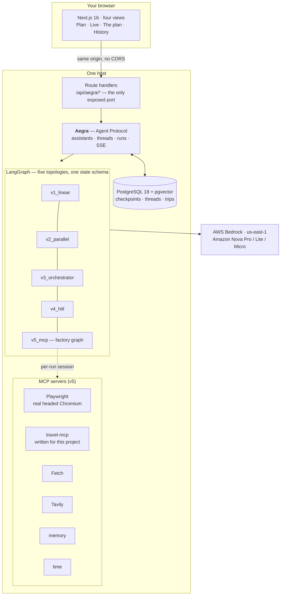
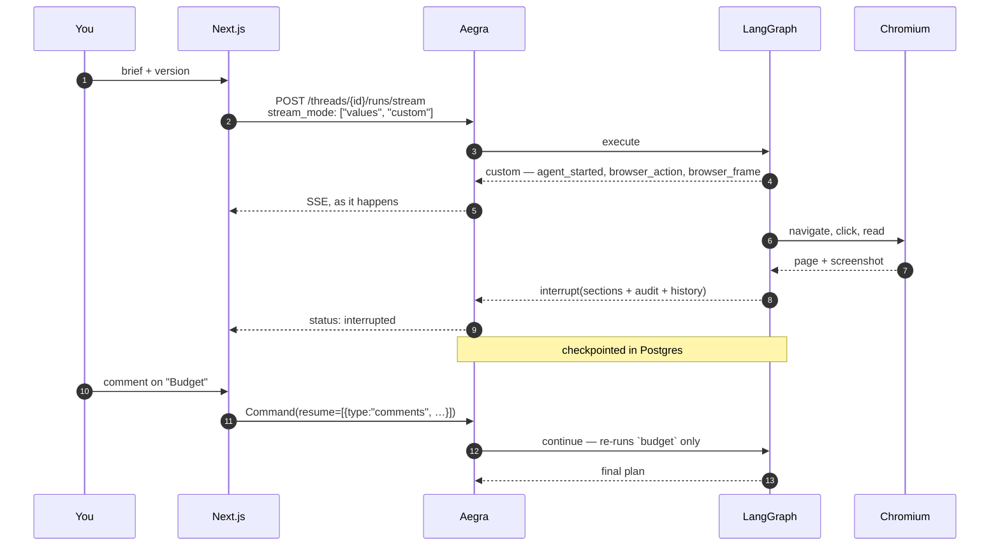

# Travel Planner Agent

**One travel planner, built five times over — linear, parallel, orchestrated, collaborative, and browser-driving — all five running side by side behind a single [Aegra](https://github.com/ibbybuilds/aegra) server and switchable at runtime.**

Plans trips from India, priced in rupees. Watch v5 drive a real Chromium, take
the browser off it when a site wants a login, and let it walk an approved plan
all the way to a live booking page.

`langgraph` · `aegra` · `agent-protocol` · `amazon-bedrock` · `amazon-nova` · `mcp` · `playwright` · `browser-automation` · `human-in-the-loop` · `nextjs` · `postgres`

---

## Why five?

Most agent projects show you one architecture and assert it is the right one.
The assertion is unfalsifiable: there is nothing to compare it against.

This one ships **five working systems**, each adding exactly one idea to the one
before it, all registered with the same server. Switching between them is one
field in an API call — not a redeploy, not a branch. So you can put the same
request through v2 and v3 and see precisely what an orchestrator buys, and what
it costs.

The answer is usually *"less than you'd think, and more than you'd like"*, which
is the sort of thing you can only learn by measuring.

### The versions

| Version | Adds | Agents | The idea |
|---|---|---|---|
| **v1** `v1_linear` | nothing — this is the control | 1 | What a good model does entirely unaided. Deliberately on the *highest* tier, so later gains can't be dismissed as v1 being handicapped |
| **v2** `v2_parallel` | fan-out + reference data | 6 | Four specialists at once, working from real station codes, GST slabs, festival dates and today's exchange rate |
| **v3** `v3_orchestrator` | a reviewer, an orchestrator, memory | 10 | The plan audits itself and re-runs what's wrong. And it remembers you, so the second trip starts better than the first |
| **v4** `v4_hitl` | section-level review | 10 | The plan arrives as sections you mark up. A comment pinned to one routes to its specialist with **no model call** |
| **v5** `v5_mcp` | six MCP servers, a live browser | 10 | Real browsing you watch and can take over, ending on a real booking page |

Every version is cumulative: **v5 is v1 with four more ideas in it.**

### Measured, not claimed

One request — *"forts and street food, reachable by train"*, from Delhi, 3 days,
2 travellers — through all five, against Amazon Nova on Bedrock. Median of three
runs each, measured at the HTTP boundary, so the wall clock includes Aegra's
checkpoint writes rather than just model time:

| Version | Wall clock | Agent time | Calls | Tokens | Budget produced |
|---|---|---|---|---|---|
| v1 | 4.0s | 2.5s | 1 | 1,860 | a range, not a figure |
| v2 | 12.1s | 12.2s | 6 | 14,481 | ₹30,200 |
| v3 | 32.1s | 33.0s | 14 | 39,534 | ₹37,900 |
| v4 | 22.1s | 19.4s | 9 | 24,191 | ₹39,500 |
| v5 | 26.2s | 17.7s | 9 | 31,131 | ₹29,000 |

Reproduce it against your own account — same brief, same method:

```bash
uv run scripts/measure_versions.py --repeat 3
```

Four things in that table are the whole argument:

**v1 produces no budget at all.** It has no research, so it gives a cost range
and states what to verify before booking — the honest output for a model working
from recall. Every later version returns a figure because something actually
looked the numbers up.

**The fan-out is real, and small.** In v2 the four parallel specialists —
attractions, budget, customs, weather — spend 5.9s of model time between them
and 2.1s of wall clock. That 3.8s is what the topology buys. It is also why v2's
agent time and wall clock come out nearly equal: the fan-out gives back roughly
what Aegra's per-node checkpointing costs at this size. Parallelism here is a
structural win that only becomes a *visible* win as the specialists get slower.

**v3 costs 14 calls where v4 costs 9** — and more to the point, v3's number
moves between runs while v4's does not. v3's orchestrator reads the reviewer's
prose and decides what to redo, so a harsher review costs more calls. v4 doesn't
decide: you point at a section, and the specialist behind it is a dictionary
lookup. Same correction, bounded cost.

**v5's wall clock runs 8.5s ahead of its agent time** — 26.2s against 17.7s,
three times the gap of any other version. Every version pays some gap to
checkpointing; v5's is mostly page loads, refusals and a live Chromium reading a
hotel listing. It is the one version where the slow part isn't the model.

---

## Aegra is the deployment

There is no application server in this project. **Aegra is it.**

[Aegra](https://github.com/ibbybuilds/aegra) is a self-hosted implementation of
the **Agent Protocol** — the same HTTP surface LangGraph Platform speaks
(assistants, threads, runs, streaming, interrupts, checkpoints), running on your
own machine against your own PostgreSQL. You point it at a `aegra.json`, it
loads your graphs, and it serves them.

```jsonc
{
  "graphs": {
    "v1_linear":       "./src/travel_planner/versions/v1_linear/graph.py:graph",
    "v2_parallel":     "./src/travel_planner/versions/v2_parallel/graph.py:graph",
    "v3_orchestrator": "./src/travel_planner/versions/v3_orchestrator/graph.py:graph",
    "v4_hitl":         "./src/travel_planner/versions/v4_hitl/graph.py:graph",
    "v5_mcp":          "./src/travel_planner/versions/v5_mcp/graph.py:make_graph"
  },
  "auth": { "path": "./src/travel_planner/auth/handler.py:auth" },
  "http": { "app": "./src/travel_planner/routes/custom.py:app" }
}
```

That file is the entire deployment descriptor. Five graphs become five
assistants; a client picks one with `assistant_id` and gets streaming, pausing
and checkpointing for free.

### What Aegra actually gives you here

| It provides | Which is why this project can… |
|---|---|
| **Assistants** — one per graph | offer a version switcher instead of five deployments |
| **Threads + Postgres checkpoints** | pause a run for a human review and resume it days later |
| **SSE run streaming** | show agents lighting up, and stream browser screenshots on the same connection |
| **`interrupt()` / `Command(resume=…)`** | implement v4's section review as protocol, not as a bespoke queue |
| **Custom route mounting** | serve `/versions`, `/handover`, `/trips` from the same process, same auth |
| **Pluggable auth** | scope threads to an owner without touching graph code |

### Static graphs versus a factory graph

The one Aegra detail worth understanding, because v5 depends on it:

```python
# v1–v4: compiled once, cached by Aegra, reused for every request.
graph = build().compile(name=VERSION)


# v5: a factory. Aegra refuses to cache these and re-invokes per request.
async def make_graph(config: RunnableConfig | None = None):
    settings = settings_for_run(config)  # per-request overrides
    return build(settings=settings).compile(name=VERSION)
```

Two things follow, and both are load-bearing:

- **Per-run resource lifetime.** MCP servers and the browser are contacted
  *inside* the run that needs them, not pinned open at server startup.
- **Per-request configuration.** A caller can pass `configurable.mcp_servers` or
  `configurable.mcp_mode` on a single run and get a graph wired to those,
  without a redeploy.

> **Why the Python floor is 3.12.** Aegra 0.10 requires it. On 3.11 the resolver
> silently picks Aegra **0.6**, which calls graph factories once and caches the
> result — and v5's entire design is a graph built per request. It isn't a
> version warning, it's a different product. `scripts/preflight.sh` checks this
> explicitly.

### Why no Docker

`aegra dev` provisions PostgreSQL in a container. Pointing `DATABASE_URL` at a
native instance and using `aegra serve` skips that entirely, so the whole stack
is four ordinary processes on an ordinary host — no daemon, no registry, no
compose file to keep in sync. On a locked-down machine that is often the
difference between deployable and not.

---

## How it's wired



Only the frontend's port is reachable. Aegra, PostgreSQL and the browser server
all stay on loopback, and the frontend proxies to them through its own route
handlers — which is also why there is no CORS configuration anywhere.

### A run, end to end



---

## LangGraph: one state, five shapes

All five versions read and write the same `TripState`. That is what makes a
version switch a one-field change at the API boundary rather than a different
data contract per version.

```python
class TripState(TypedDict):
    messages: NotRequired[Annotated[list[BaseMessage], add_messages]]
    destination: NotRequired[DestinationChoice | None]
    budget: NotRequired[BudgetBreakdown | None]
    review: NotRequired[Review | None]
    revisions: NotRequired[list[Revision] | None]
    agent_runs: NotRequired[Annotated[list[AgentRun], operator.add]]
    ...
```

Two constraints in that file are the product of real debugging:

**Every non-`messages` key is `NotRequired`.** `str | None` says a *present* key
may be `None`; it does not permit the key to be absent. Fields like `review`
genuinely don't exist when an early node runs, and without `NotRequired`
Pydantic fails with "Field required" the first time a node sees the state —
which LangGraph surfaces as a blank error.

**And the module must never use `from __future__ import annotations`,** which
turns annotations into strings and makes `TypedDict` silently mark every key
required again. An AST-based test guards it.

### v3's targeted re-run, through a static fan-in

LangGraph's list-form join `add_edge([a, b, c, d], target)` fires when all four
complete — right for the first pass, but it cannot wait for a *subset*. So a
revision that should re-run only `hotel` can't just route to `hotel`.

The answer is to route to the whole fan-out layer and let each node gate itself:

```python
def rerun_aware(agent: BaseAgent):
    def node(state: TripState) -> dict[str, Any]:
        decision = state.get("orchestrator_decision")
        if decision is None:
            return agent(state)  # first pass: everyone runs
        targets = set(decision.agents_to_rerun)
        wanted = (
            "destination" in targets  # a new destination invalidates all
            or agent.name in targets
            or any(d in targets for d in DEPENDS_ON.get(agent.name, ()))
        )
        return agent(state) if wanted else {}  # skipped nodes still "complete"

    return node
```

Skipped nodes still complete, so the join fires exactly as on the first pass.
Dependencies are declared once (`packing` consumes `weather`; `hotel` consumes
`budget`) rather than encoded in edges.

### Two kinds of pause, and why they are different

This is the sharpest design point in the project.

```
v4 plan review   →  interrupt()      →  run STOPS, state persists, answer in days
v5 browser handover → blocking queue →  run CONTINUES, because the browser must
```

`interrupt()` raises out of the node. LangGraph checkpoints and the run stops —
perfect for a plan review, where nothing is held open. **A browser handover
cannot work that way:** the node is holding a live Chromium with a half-finished
login in it, and unwinding closes exactly the thing you were about to take over.

So a handover keeps the node running and blocks on an in-process queue. Two
consequences, both deliberate: it is **time-bounded** (a blocked node holds one
of very few browser slots) and the queue is **in-process** (routing a click to a
worker that doesn't hold the Chromium accomplishes nothing).

---

## The agents, and model tiering

Ten specialists. A specialist is four class attributes and one method — the
rest (messages, invocation, repair, escalation, telemetry, failure handling) is
shared, so it's implemented and tuned once.

```python
class WeatherAgent(BaseAgent):
    name = "weather"
    tier = "low"
    schema = WeatherReport
    state_key = "weather"
    system_prompt = WEATHER_PROMPT

    def user_prompt(self, state: TripState) -> str: ...
```

An agent instance *is* a valid LangGraph node: `graph.add_node("weather", WeatherAgent())`.
**Versions differ in how nodes are wired, not in the nodes.**

| Tier | Model | Agents | Why |
|---|---|---|---|
| high | `us.amazon.nova-pro-v1:0` | orchestrator, review, itinerary | routing decisions, auditing, multi-day synthesis |
| mid | `us.amazon.nova-lite-v1:0` | destination, hotel, attraction, budget | moderate reasoning with structured output |
| low | `us.amazon.nova-micro-v1:0` | weather, packing, customs | extraction-shaped; text-only is enough |
| fallback | `us.meta.llama3-3-70b-instruct-v1:0` | any agent that needs it | cross-family escape hatch, per agent |

### Structured output that survives a small model

Every agent returns a validated Pydantic object, never prose. `with_structured_output()`
is tool-calling under the hood, and tool-calling degrades sharply with nesting —
so **every output schema is at most one level deep.** That's a correctness
measure, not a style preference.

When one fails anyway, three things happen in order:

1. **Repair** — feed the validation error back so the model sees which field was wrong.
2. **Escalate** — retry on the next tier up. Micro → Lite → Pro → cross-family.
3. **Fail loudly** — `StructuredOutputError` carries every (model, error) pair.

Two schema-level lessons are baked in, both from live failures:

```python
class BudgetBreakdown(BaseModel):
    hotel: float = Field(ge=0)
    ...
    currency: Literal["INR"] = "INR"  # a Literal, not a default — see below

    @model_validator(mode="after")
    def _recompute_total(self):
        computed = round(
            self.hotel + self.food + self.transport + self.activities + self.miscellaneous, 2
        )
        if computed <= 0:
            raise ValueError("the budget is empty — every category is zero…")
        object.__setattr__(self, "total", computed)
        return self
```

- **The total is derived, never trusted.** An agent once anchored every category
  correctly and returned a total of ₹4,050 against a true sum of ₹35,440. Asking
  a language model for a number you can compute is inviting a failure you never
  had to have.
- **The currency is a `Literal`, not a default.** A default only applies when a
  field is *omitted*, and it wasn't — the model returned `USD` while another
  agent wrote rupees in its prose. Two currencies in one plan, no error
  anywhere. Now the wrong answer is unrepresentable and the repair loop turns it
  into a retry.

---

## MCP: six servers, two lifetimes

| Server | Transport | Provides |
|---|---|---|
| **Playwright** | stdio (or http) | a real, **headed** Chromium |
| **travel-mcp** | stdio | 10 tools: 32 Indian cities with IRCTC/airport codes, rail fares, hotel GST slabs, festivals, seasons, visa rules, flight bands |
| **Fetch** | stdio | structured HTTP where a browser is overkill — today's USD→INR rate |
| **Tavily** | streamable-http | hosted search |
| **memory** | stdio | the traveller's knowledge graph |
| **time** | stdio | the current time in Asia/Kolkata, so "next November" means something |

The distinction that cost the most to find:

**Stateless servers** go through `get_tools()`, which opens and closes a session
per call. Every call is independent; no subprocess is held between uses.

**The browser cannot work that way.** `browser_navigate` and `browser_snapshot`
only make sense against the *same* session — with a session per call the
navigate happens in one browser and the snapshot reads a second, freshly
launched one, which returns `about:blank` every time. Nothing errors. The tools
succeed; the page is just empty. `browser_session()` holds one session across
the whole sequence.

> **Headless does not get in.** Measured: headless Chromium is refused by
> `makemytrip.com` and `goibibo.com` with `net::ERR_HTTP2_PROTOCOL_ERROR` — the
> TLS handshake completes and the HTTP/2 stream is then reset, on their home
> pages as much as their deep links. That's client fingerprinting, not rate
> limiting. The same navigation headed loads both. On a server with no display,
> `xvfb-run` supplies one.

---

## The browser: watch it, take it, book with it

### Watch it

Every navigation, click and refusal emits an event and captures a screenshot,
streamed over the same SSE connection as the plan. A node's state update doesn't
reach a client until the node *returns* — fine for an agent thinking for five
seconds, useless for a browser working for ninety. So the run pushes:

```python
events.browser_action("navigate", detail=url, url=url)
events.browser_frame(path, note="reading the page")
events.needs_human(reason="login", prompt="This page wants you to sign in.")
```

Frames are written to disk and referenced by path, not inlined — a base64 JPEG
is 100–300 KB and at one per action would make the live view *slower* than the
browsing it's showing.

### Take it

When a page needs a person, the run stops and offers you the browser. **Clicking
the screenshot clicks the real page**: screenshots are viewport-sized at
devicePixelRatio 1, so image pixels and page coordinates are the same numbers.
There are controls for typing, Enter, Tab, scrolling and Back, and the run
continues when you say you're done.

Typed text **never** reaches the action log — someone taking over a login types
into the same browser the log is describing, so it records *"12 characters into
Password"* and never the characters.

### Book with it

Two browsing strategies, because they answer different questions:

```
browser.py   a fixed choreography — right when you know which page has the answer
agent.py     look, decide, act, look again — right when you don't
```

The agent is a bounded loop: a **closed action set**, a step budget, a clock,
and structured decisions with the repair loop behind them. The login/payment
gate runs **before** the model is consulted and overrides it — a model must not
be able to decide to type into a password field.

It works. From a hotel listing:

```
1. click "Lemon Tree Hotel Agra"  → opened a new tab
2. click "VIEW 51 ROOM OPTIONS"   → nothing changed, try a different one
3. click "SELECT"                 → you are now on /hotels/nhotel-booking/?…
                                  → reached a payment page — this needs you
```

**12 consecutive runs end on goibibo's booking page for a named hotel.**

---

## Memory: the second trip starts better than the first

What separates v3 from v2 is that facts survive a run. A `recall` node sits
between the destination and the fan-out; a `remember` node runs after the plan
is finalised — and only when there *is* a plan, because an abandoned run says
nothing true about anyone.

```
trip 1 → Jaipur.  Known about this traveller: nothing yet.
trip 2 → Goa.     Known about this traveller: travels from Delhi; books at a
                  budget level; interested in history; has already travelled
                  to Agra, Goa, Jaipur, Kyoto
```

`recall()` reads the whole graph rather than searching it by name. A name-scoped
search returns only the traveller node — silently excluding every destination
they've visited, so *"somewhere I haven't been"*, the single most useful thing
memory enables, could never have worked.

---

## Storage that cleans up after itself

A finished trip keeps its plan and **deletes everything that produced it** —
a few kilobytes kept, roughly 110 KB reclaimed per run.

```bash
curl -s localhost:2026/admin/storage | jq     # what's being held
curl -sX POST localhost:2026/admin/sweep | jq # clear abandoned runs now
```

Abandoned runs are the growth nobody notices: someone opens the planner, changes
their mind, closes the tab. An hourly sweeper clears those. Verified: both
archived trips have **0 thread rows and 0 checkpoints**.

> `purge_thread` deletes `checkpoint_writes`, `checkpoint_blobs` and
> `checkpoints` explicitly. There are no foreign keys between them — they do
> **not** cascade.

---

## Getting started

```bash
# 0. Prerequisites: Python ≥ 3.12, Node ≥ 22, PostgreSQL 18, uv
git clone https://github.com/adarshcod30/Travel-Planner-Agent
cd Travel-Planner-Agent

# 1. Python deps (creates .venv)
uv sync

# 2. Configure — add your AWS keys or set AWS_PROFILE
cp .env.example .env

# 3. PostgreSQL + pgvector (idempotent; installs nothing)
brew install postgresql@18 pgvector      # macOS; apt equivalents on Linux
./scripts/bootstrap_postgres.sh

# 4. Chromium for v5's browser automation
npx playwright install chromium

# 5. Check this host can actually run it (read-only; spends nothing)
./scripts/preflight.sh

# 6. Start everything — PostgreSQL, Aegra and the frontend
./scripts/run_all.sh
```

Open <http://localhost:3000>. Verify the backend on its own with:

```bash
curl -s localhost:2026/health/deep | jq
```

### Or start the pieces separately

```bash
./scripts/run_aegra.sh          # terminal 1 — migrations run automatically
cd frontend && npm run dev      # terminal 2
```

### Share it on your network

```bash
./scripts/serve_lan.sh          # prints the shareable URL
```

Prefer the `.local` address it prints — it survives moving to another network,
where the IP does not. Only port 3000 needs to be reachable.

---

## Using it

**Plan a trip** — pick an architecture from the drawer on the right edge, then
describe the trip. Everything under *Tell it more* is optional and most of it
stays closed, but it's the half of a brief a traveller knows and is never asked
for: an exact date, a hard rupee ceiling (a *limit*, distinct from a budget
preference), dietary needs, how well everyone walks, who's coming, the occasion.
It all reaches every specialist's prompt.

**Live** — one sentence for what's happening now, the browser stage when there
is one, and Activity / Agents / Sources behind tabs.

**The plan** — sections you comment on (v4+), then the finished document with
**Export PDF**, then a booking offer (v5).

**History** — trips that finished. This table is the only record they happened.

---

## Configuration

| Setting | Default | What it controls |
|---|---|---|
| `AWS_REGION` | `us-east-1` | Bedrock region |
| `MCP_ENABLED_SERVERS` | all six | trim to disable one without code changes |
| `MCP_MODE` | `stdio` | `http` keeps one browser server alive across runs |
| `PLAYWRIGHT_MCP_HEADLESS` | `false` | headless is refused by the booking sites |
| `MAX_CONCURRENT_BROWSERS` | `2` | ~1.3 GB each; the limit that actually matters |
| `BROWSER_SLOT_TIMEOUT_SECONDS` | `180` | how long a run waits for a free browser |
| `BROWSER_HANDOVER_TIMEOUT_SECONDS` | `300` | how long it holds one open for you |
| `BROWSER_AGENT_MAX_STEPS` | `22` | a hotel search is legitimately a dozen actions |
| `BOOKING_ENABLED` | `true` | whether v5 offers to open real booking pages |
| `MAX_ORCHESTRATOR_ITERATIONS` | `3` | the revision ceiling |
| `PURGE_THREAD_ON_COMPLETE` | `true` | reclaim a run once its plan is archived |

The scarce resource is **browsers, not requests** — v1–v4 launch none, so a
request cap either throttles the cheap versions or lets the expensive one pile
up. Runs past the cap queue for a slot rather than launching another Chrome.

---

## Testing

Three tiers, separated by what each one needs to be true.

```bash
uv run pytest -m "not live and not integration"   # 631 — no credentials, no network
uv run pytest -m "integration and not live"       # 18  — needs a running server
uv run pytest -m live                             # 20  — spends real Bedrock calls
uv run ruff check . && uv run ruff format --check . && uv run mypy src
```

**Hermetic (631).** Every model call is scripted, so a graph's topology, routing
and state handling are tested with no network and no account. This is the tier
that runs on every push.

**Serving (18).** The half the hermetic tier cannot reach. Those 631 tests
compile the graphs with an in-memory checkpointer and call them directly — which
is exactly why they are fast, and exactly why they say nothing about Aegra. This
tier boots a real server against a real Postgres and checks the things only a
server has: the manifest wiring, assistant registration at derived ids, the
checkpointer Aegra injects into graphs that never construct one, and the custom
routes on the same port. It spends nothing — state is written directly rather
than generated, so persistence is tested without paying a model to produce
something to persist. CI runs it in its own job with a Postgres service.

**Live (20).** Every agent's schema in front of the real Nova tier it is
assigned to, which is the one thing a mock cannot tell you. Opt-in, and the only
tier that costs money.

The table at the top of this file comes from `scripts/measure_versions.py`, not
from any of them.

Ten more are tests of the **repository** rather than the product, because
each thing they check has already gone wrong once: a tooling directory reaching
a commit, a credential-bearing file one careless `git add` away, Next 16
quietly writing an instruction file into the tree on every `npm run dev`, and
157 screenshots of live browsing sessions riding along in ten commits before
anything noticed.

They check *shape* rather than names — "the only markdown at the root is the
README", not a list of the files today's tools generate — and they ask
`git check-ignore` rather than searching `.gitignore` for a substring, so what
is tested is the rule's effect.

One thing to know before editing this file: `ruff format` reaches into
Python fenced blocks in Markdown, so every snippet in the docs has to be real,
parseable, canonically-formatted Python. That is a feature — a code
example that no longer parses fails CI instead of quietly rotting — but it does
mean hand-aligned `=` signs get collapsed.

---

## Project structure

```
├── aegra.json                    5 graphs → 5 assistants; auth; custom routes
├── src/travel_planner/
│   ├── core/                     state schema, Bedrock tiering, events, storage, money
│   ├── agents/                   10 specialists — a constant across all versions
│   ├── prompts/                  one system prompt per agent, plus the India context
│   ├── tools/mcp/                client, browser chain, control, agent loop,
│   │                             handover, booking, explore, memory, frames
│   ├── versions/                 v1…v5 — the topologies, and the gates between them
│   ├── auth/                     Aegra auth + ownership handlers
│   └── routes/                   /versions /agents /handover /trips /health/deep
├── mcp-servers/travel-mcp/       standalone MCP server, 10 tools, Indian travel data
├── frontend/src/
│   ├── app/                      planner, comparison, access gate, Aegra proxy
│   ├── components/               four views + the browser stage and review panel
│   └── lib/                      Aegra client, the run hook, types
├── deploy/systemd/               three units for a shared host
├── scripts/                      preflight, postgres bootstrap, aegra runner, LAN serving,
│                                 measure_versions.py (the table at the top)
├── tests/                        hermetic · serving (needs a server) · live (costs money)
└── docs/                         architecture, versions, deployment, models, intranet,
                                  and the two plans this was built from
```

---

## Documentation

| Document | Contents |
|---|---|
| [ARCHITECTURE.md](docs/ARCHITECTURE.md) | How the pieces fit, and the decisions behind them |
| [VERSIONS.md](docs/VERSIONS.md) | What each version adds, and why |
| [INTRANET.md](docs/INTRANET.md) | Running it for a team: systemd, capacity, storage |
| [AEGRA_DEPLOYMENT.md](docs/AEGRA_DEPLOYMENT.md) | Why Aegra runs natively rather than in a container |
| [MODELS.md](docs/MODELS.md) | Tiering, structured-output resilience, cost |
| [travel-mcp](mcp-servers/travel-mcp/README.md) | The custom MCP server |
| [DEVELOPMENT_PLAN.md](docs/DEVELOPMENT_PLAN.md) | The original plan for the five versions — delivered |
| [ENHANCEMENT_PLAN.md](docs/ENHANCEMENT_PLAN.md) | The plan for live browsing and takeover, and where it was wrong |

---

## Safety boundary

v5 drives a real browser, opens real booking pages, and hands them to you when a
site needs a person. It **never enters payment details and never completes a
purchase**, under any configuration — a page asking for a card, UPI or bank
details ends the automated part rather than being driven through.

That's a deliberate boundary, not an unimplemented feature. Two smaller rules
follow from it:

- **Typed text is never logged.** The action log records *"12 characters into
  Password"* and never the characters.
- **The action set is closed.** Instructions arrive over HTTP and aim at a live
  browser, so anything outside a fixed list — or carrying an unexpected key — is
  refused rather than reinterpreted.

The card/UPI check runs **before** any exemption, so an exemption for marketing
pages can never carry a genuine payment form through with it.

---

## License

MIT
