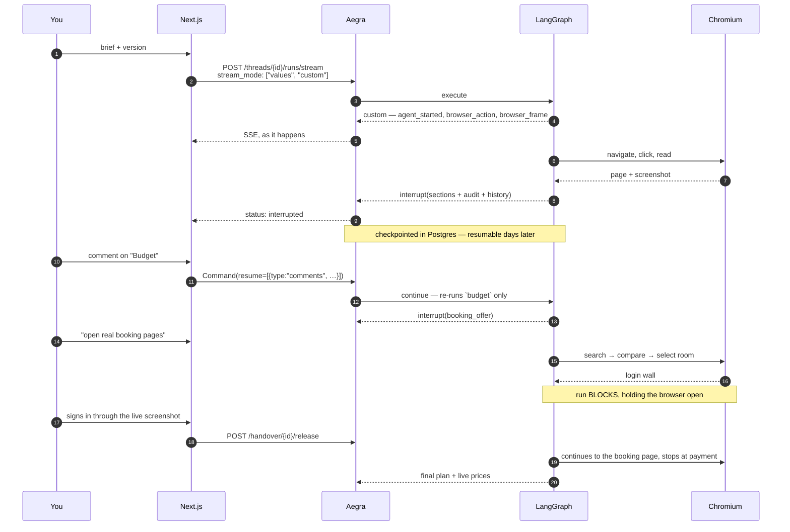
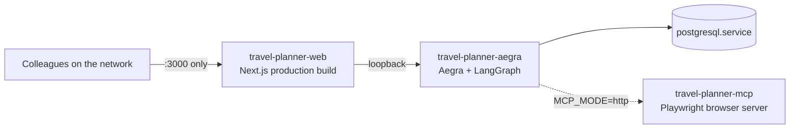

<div align="center">

# Travel Planner Agent

### One travel planner, built five times over — linear, parallel, orchestrated, collaborative, and browser-driving — all five running side by side behind a single [Aegra](https://github.com/ibbybuilds/aegra) server and switchable at runtime.

[](https://github.com/adarshcod30/Travel-Planner-Agent/actions/workflows/ci.yml)
[](https://www.python.org/)
[](https://langchain-ai.github.io/langgraph/)
[](https://github.com/ibbybuilds/aegra)
[](https://aws.amazon.com/bedrock/)
[](LICENSE)
[](https://github.com/adarshcod30/Travel-Planner-Agent/commits/main)

[**Report Bug**](https://github.com/adarshcod30/Travel-Planner-Agent/issues) &nbsp;·&nbsp; [**Request Feature**](https://github.com/adarshcod30/Travel-Planner-Agent/issues) &nbsp;·&nbsp; [**Architecture**](docs/ARCHITECTURE.md) &nbsp;·&nbsp; [**Versions**](docs/VERSIONS.md)

</div>

Plans trips from India, priced in rupees. Watch v5 drive a real Chromium, take
the browser off it when a site wants a login, and let it walk an approved plan
all the way to a live booking page.

**Topics:**
`langgraph` · `aegra` · `agent-protocol` · `multi-agent` · `amazon-bedrock` ·
`amazon-nova` · `mcp` · `model-context-protocol` · `playwright` ·
`browser-automation` · `human-in-the-loop` · `hitl` · `ai-agents` ·
`langchain` · `nextjs` · `react` · `postgresql` · `travel-planner` ·
`agentic-ai` · `self-hosted`

---

## Table of Contents

- [Overview](#overview)
- [Key Features](#key-features)
- [Why five?](#why-five)
- [Measured, not claimed](#measured-not-claimed)
- [Tech Stack](#tech-stack)
- [System Architecture](#system-architecture)
- [Application Flow](#application-flow)
- [Aegra is the deployment](#aegra-is-the-deployment)
- [LangGraph: one state, five shapes](#langgraph-one-state-five-shapes)
- [The agents, and model tiering](#the-agents-and-model-tiering)
- [MCP: six servers, two lifetimes](#mcp-six-servers-two-lifetimes)
- [Human-in-the-loop](#human-in-the-loop)
- [The browser: watch it, take it, book with it](#the-browser-watch-it-take-it-book-with-it)
- [Memory](#memory-the-second-trip-starts-better-than-the-first)
- [Storage that cleans up after itself](#storage-that-cleans-up-after-itself)
- [Getting Started](#getting-started)
- [Using it](#using-it)
- [API Reference](#api-reference)
- [Configuration](#configuration)
- [Deployment & Infrastructure](#deployment--infrastructure)
- [Testing](#testing)
- [Project Structure](#project-structure)
- [Documentation](#documentation)
- [Safety boundary](#safety-boundary)
- [Troubleshooting](#troubleshooting)
- [Roadmap](#roadmap)
- [Contributing](#contributing)
- [License](#license)
- [Contact](#contact)

---

## Overview

**Problem.** Most agent projects ship one architecture and assert it is the right
one. The assertion is unfalsifiable, because there is nothing to compare it
against. "Add an orchestrator" and "put a human in the loop" are advice, not
measurements — nobody tells you what they cost.

**Solution.** This ships **five working systems**, each adding exactly one idea
to the one before it, all registered with the same server against the same state
schema. Switching between them is one field in an API call — not a redeploy, not
a branch. Put the same request through v2 and v3 and you see precisely what an
orchestrator buys and what it costs.

**Why it matters.** The answer is usually *"less than you'd think, and more than
you'd like"* — and in this repo's own numbers, the fashionable choice loses:
**v3's self-correcting orchestrator costs more tokens than v5's live browsing**,
and its bill changes between identical requests. That is not a thing you can
learn from a blog post. It is a thing you learn by building both and measuring.

The travel planning is the workload, not the point. It was chosen because it
decomposes honestly (weather, budget, hotels and attractions really are
independent, so the fan-out is not contrived), it has a real correctness signal
(a budget is right or wrong, in rupees), and it has a legitimate reason to touch
the live web.

---

## Key Features

| Feature | What it does |
|---|---|
| **Five architectures, one server** | v1 → v5 registered as five assistants on one Aegra instance. Switch with one API field; no redeploy, no branch |
| **Runtime version switching** | The UI's architecture drawer changes `assistant_id`. The same brief can be run through two topologies back to back |
| **Reproducible benchmarks** | `scripts/measure_versions.py` drives all five over HTTP and reports wall clock, agent time, calls and tokens. The table below is its output |
| **Human-in-the-loop, per section** | v4 returns the plan as commentable sections. A comment routes to its specialist through a dictionary lookup — **zero orchestrator calls** |
| **Live browser you can watch** | v5 drives a real headed Chromium; every navigation, click and refusal streams to the UI as an event plus a screenshot |
| **Human takeover of the browser** | When a site wants a login, the run blocks and hands you the live browser. Clicking the screenshot clicks the real page |
| **Booking to the payment boundary** | Walks an approved plan to a real booking page for a named hotel — and stops. Never enters payment details, under any configuration |
| **Six MCP servers, two lifetimes** | Playwright, a purpose-built `travel-mcp`, Fetch, Tavily, memory and time — stateless ones per call, the browser held across a session |
| **Cross-trip memory** | A knowledge graph over MCP, so the second trip starts knowing where you have already been |
| **Model tiering** | Ten agents mapped to Nova Pro / Lite / Micro by how hard the job is, with a repair-and-escalate loop for structured output |
| **Storage that reclaims itself** | A finished trip keeps its plan and deletes everything that produced it — ~110 KB per run |
| **Runs natively, no Docker** | Four ordinary processes on an ordinary host. Deployable on a locked-down machine with no container runtime |
| **Three-tier test suite** | 630 hermetic · 18 serving (real Aegra + Postgres, in CI) · 20 live. Type-checked, linted and formatted on every push |

---

## Why five?

Every version is cumulative: **v5 is v1 with four more ideas in it.**

| Version | Adds | Agents | The idea |
|---|---|---|---|
| **v1** `v1_linear` | nothing — this is the control | 1 | What a good model does entirely unaided. Deliberately on the *highest* tier, so later gains can't be dismissed as v1 being handicapped |
| **v2** `v2_parallel` | fan-out + reference data | 6 | Four specialists at once, working from real station codes, GST slabs, festival dates and today's exchange rate |
| **v3** `v3_orchestrator` | a reviewer, an orchestrator, memory | 10 | The plan audits itself and re-runs what's wrong. And it remembers you, so the second trip starts better than the first |
| **v4** `v4_hitl` | section-level review | 10 | The plan arrives as sections you mark up. A comment pinned to one routes to its specialist with **no model call** |
| **v5** `v5_mcp` | six MCP servers, a live browser | 10 | Real browsing you watch and can take over, ending on a real booking page |

### Measured, not claimed

One request — *"forts and street food, reachable by train"*, from Delhi, 3 days,
2 travellers — through all five, against Amazon Nova on Bedrock. Median of three
runs each, measured at the HTTP boundary, so the wall clock includes Aegra's
checkpoint writes rather than just model time:

| Version | Wall clock | Agent time | Calls | Tokens | Budget produced |
|---|---|---|---|---|---|
| v1 | 4.0s | 2.5s | 1 | 1,860 | a range, not a figure |
| v2 | 12.1s | 12.2s | 6 | 14,481 | ₹30,200 |
| v3 | 32.1s | 33.0s | 14 | 39,534 | ₹37,900 |
| v4 | 22.1s | 19.4s | 9 | 24,191 | ₹39,500 |
| v5 | 26.2s | 17.7s | 9 | 31,131 | ₹29,000 |

Reproduce it against your own account — same brief, same method:

```bash
uv run scripts/measure_versions.py --repeat 3
```

Four things in that table are the whole argument:

**v1 produces no budget at all.** It has no research, so it gives a cost range
and states what to verify before booking — the honest output for a model working
from recall. Every later version returns a figure because something actually
looked the numbers up.

**The fan-out is real, and small.** In v2 the four parallel specialists —
attractions, budget, customs, weather — spend 5.9s of model time between them
and 2.1s of wall clock. That 3.8s is what the topology buys. It is also why v2's
agent time and wall clock come out nearly equal: the fan-out gives back roughly
what Aegra's per-node checkpointing costs at this size. Parallelism here is a
structural win that only becomes a *visible* win as the specialists get slower.

**v3 costs 14 calls where v4 costs 9** — and more to the point, v3's number
moves between runs while v4's does not. v3's orchestrator reads the reviewer's
prose and decides what to redo, so a harsher review costs more calls. v4 doesn't
decide: you point at a section, and the specialist behind it is a dictionary
lookup. Same correction, bounded cost.

**v5's wall clock runs 8.5s ahead of its agent time** — 26.2s against 17.7s,
three times the gap of any other version. Every version pays some gap to
checkpointing; v5's is mostly page loads, refusals and a live Chromium reading a
hotel listing. It is the one version where the slow part isn't the model.

---

## Tech Stack

| Layer | Technology | Why |
|---|---|---|
| **Agent runtime** | LangGraph 1.2 | `StateGraph`, `interrupt()`/`Command(resume=)`, list-form fan-in, custom event streaming |
| **Agent server** | **Aegra 0.10** (Agent Protocol) | Self-hosted assistants, threads, runs, SSE, checkpoints — the whole deployment |
| **Models** | AWS Bedrock — Amazon Nova Pro / Lite / Micro | Tiered per agent; Llama 3.3 70B as the escalation fallback |
| **Model access** | `langchain-aws` `ChatBedrockConverse` | One Converse API across every model family |
| **Tools** | Model Context Protocol — 6 servers | Playwright, `travel-mcp` (own), Fetch, Tavily, memory, time |
| **Browser** | Playwright MCP, **headed** Chromium | Headless is refused by the booking sites |
| **Database** | PostgreSQL 18 + pgvector (native) | Checkpoints, threads, archived trips |
| **Queue** | Redis (optional) | Run queueing when configured; browsers are capped separately |
| **Frontend** | Next.js 16 · React 19 · Tailwind 4 · TypeScript | Route-handler proxy means no CORS anywhere |
| **Validation** | Pydantic v2 + `pydantic-settings` | Every agent returns a validated schema, not prose |
| **Packaging** | `uv` | Lockfile-driven, reproducible installs |
| **CI/CD** | GitHub Actions — 3 jobs | Backend (lint, format, mypy, 630 tests), Frontend (tsc, eslint, build), Serving layer (real Postgres + Aegra) |
| **Quality** | ruff · mypy · pytest | Lint, format and types all blocking |
| **Deployment** | systemd, native | Three units; no Docker, no compose file |

---

## System Architecture

Four processes on one host. Only the frontend's port is reachable — Aegra,
PostgreSQL and the browser server all stay on loopback, and the frontend proxies
to them through its own Next.js route handlers, which is also why there is no
CORS configuration anywhere in the project. Aegra loads the five graphs from
`aegra.json`, supplies each with a Postgres-backed checkpointer, and mounts this
project's custom FastAPI routes on the same port under the same auth.


## Application Flow

From brief to booking page. Note two different pauses: the section review
**checkpoints and stops** (answerable days later), while the browser handover
**blocks a live run** (because stopping it would close the Chromium you were
about to take over).



---

## Aegra is the deployment

There is no application server in this project. **Aegra is it.**

[Aegra](https://github.com/ibbybuilds/aegra) is a self-hosted implementation of
the **Agent Protocol** — the same HTTP surface LangGraph Platform speaks
(assistants, threads, runs, streaming, interrupts, checkpoints), running on your
own machine against your own PostgreSQL. You point it at an `aegra.json`, it
loads your graphs, and it serves them.

```jsonc
{
  "dependencies": ["./src"],
  "graphs": {
    "v1_linear":       "./src/travel_planner/versions/v1_linear/graph.py:graph",
    "v2_parallel":     "./src/travel_planner/versions/v2_parallel/graph.py:graph",
    "v3_orchestrator": "./src/travel_planner/versions/v3_orchestrator/graph.py:graph",
    "v4_hitl":         "./src/travel_planner/versions/v4_hitl/graph.py:graph",
    "v5_mcp":          "./src/travel_planner/versions/v5_mcp/graph.py:make_graph"
  },
  "auth": { "path": "./src/travel_planner/auth/handler.py:auth" },
  "http": { "app":  "./src/travel_planner/routes/custom.py:app" }
}
```

That file is the entire deployment descriptor. Five graphs become five
assistants; a client picks one with `assistant_id` and gets streaming, pausing
and checkpointing for free.

### What Aegra actually gives you here

| It provides | Which is why this project can… |
|---|---|
| **Assistants** — one per graph | offer a version switcher instead of five deployments |
| **Threads + Postgres checkpoints** | pause a run for a human review and resume it days later |
| **SSE run streaming** | show agents lighting up, and stream browser screenshots on the same connection |
| **`interrupt()` / `Command(resume=…)`** | implement v4's section review as protocol, not as a bespoke queue |
| **Custom route mounting** | serve `/versions`, `/handover`, `/trips` from the same process, same auth |
| **Pluggable auth** | scope threads to an owner without touching graph code |

### The relationship is inverted

Across all of `src/`, Aegra is imported **exactly once** — a namespace constant,
with a fallback if that import ever moves. The project does not call Aegra;
Aegra calls the project.

The clearest evidence is the checkpointer. Every graph compiles bare:

```python
graph = build().compile(name=VERSION)
```

No `checkpointer=` anywhere in production code — the only `MemorySaver()` in the
repo is in tests, precisely because tests run *without* Aegra. So v4's
`interrupt()`, resuming a review days later, and thread state surviving a
restart all work because Aegra injects Postgres-backed checkpointing into a graph
that never asked for one.

That inversion is why a compiled graph costs **117 KB** and adding a sixth
architecture would cost roughly that.

### Static graphs versus a factory graph

The one Aegra detail worth understanding, because v5 depends on it:

```python
# v1-v4: compiled once, cached by Aegra, reused for every request.
graph = build().compile(name=VERSION)


# v5: a factory. Aegra refuses to cache these and re-invokes per request.
async def make_graph(config: RunnableConfig | None = None):
    settings = settings_for_run(config)  # per-request overrides
    return build(settings=settings).compile(name=VERSION)
```

At boot, Aegra imports all five modules and then splits them:

```text
declared in aegra.json : ['v1_linear', 'v2_parallel', 'v3_orchestrator', 'v4_hitl', 'v5_mcp']
COMPILED, held resident: ['v1_linear', 'v2_parallel', 'v3_orchestrator', 'v4_hitl']
factories, NOT called  : ['v5_mcp']
```

Two things follow, and both are load-bearing:

- **Per-run resource lifetime.** MCP servers and the browser are contacted
  *inside* the run that needs them, not pinned open at server startup.
- **Per-request configuration.** A caller can pass `configurable.mcp_servers` or
  `configurable.mcp_mode` on a single run and get a graph wired to those,
  without a redeploy.

A practical consequence: editing v1–v4 needs a server restart, because their
compiled graph is cached. Editing v5 does not.

> **Why the Python floor is 3.12.** Aegra 0.10 requires it. On 3.11 the resolver
> silently picks Aegra **0.6**, which calls graph factories once and caches the
> result — and v5's entire design is a graph built per request. It isn't a
> version warning, it's a different product. `scripts/preflight.sh` checks this
> explicitly.

### Why no Docker

`aegra dev` provisions PostgreSQL in a container. Pointing `DATABASE_URL` at a
native instance and using `aegra serve` skips that entirely, so the whole stack
is four ordinary processes on an ordinary host — no daemon, no registry, no
compose file to keep in sync. On a locked-down machine that is often the
difference between deployable and not.

---

## LangGraph: one state, five shapes

All five versions read and write the same `TripState`. That is what makes a
version switch a one-field change at the API boundary rather than a different
data contract per version.

```python
class TripState(TypedDict):
    messages: NotRequired[Annotated[list[BaseMessage], add_messages]]
    destination: NotRequired[DestinationChoice | None]
    budget: NotRequired[BudgetBreakdown | None]
    review: NotRequired[Review | None]
    revisions: NotRequired[list[Revision] | None]
    agent_runs: NotRequired[Annotated[list[AgentRun], operator.add]]
    ...
```

Two constraints in that file are the product of real debugging:

**Every non-`messages` key is `NotRequired`.** `str | None` says a *present* key
may be `None`; it does not permit the key to be absent. Fields like `review`
genuinely don't exist when an early node runs, and without `NotRequired`
Pydantic fails with "Field required" the first time a node sees the state —
which LangGraph surfaces as a blank error.

**The module must not use `from __future__ import annotations`.** It turns every
annotation into a string, and `TypedDict` resolves `NotRequired` at class-creation
time — so with it, every key silently lands in `__required_keys__` and the above
breaks again, invisibly.

### v3's targeted re-run, through a static fan-in

The orchestrator decides which specialists to re-run. But a LangGraph fan-in
waits for *every* incoming edge, so a node that simply doesn't execute stalls the
join forever. The fix is that skipped nodes still run — and return nothing:

```python
def rerun_aware(agent: BaseAgent) -> Node:
    def node(state: TripState) -> dict[str, Any]:
        decision = state.get("orchestrator_decision")
        if decision is None:
            return agent(state)  # first pass: everyone runs
        targets = set(decision.agents_to_rerun)
        wanted = (
            "destination" in targets  # a new destination invalidates all
            or agent.name in targets
            or any(d in targets for d in DEPENDS_ON.get(agent.name, ()))
        )
        return agent(state) if wanted else {}  # skipped nodes still "complete"

    return node
```

`DEPENDS_ON` is what makes a correction coherent: commenting on *hotels* re-runs
`hotel`, and also `itinerary` (an itinerary that cites a hotel is stale the
moment the hotel changes) and `review` (an audit of the old draft no longer
describes the new one).

### Two kinds of pause, and why they are different

| | v4 section review | v5 browser handover |
|---|---|---|
| Mechanism | `interrupt()` | in-process blocking queue |
| Run state | stopped, checkpointed | **alive**, holding a browser |
| Answerable | days later | minutes — it expires |
| Survives restart | yes | no |

A handover cannot use `interrupt()`: stopping the run would close the Chromium
you were about to take over. So the run stays alive and blocks — which is
exactly why a handover expires after five minutes and a plan review does not.

---

## The agents, and model tiering

Ten specialists. A specialist is four class attributes and one method — the rest
(messages, invocation, repair, escalation, telemetry, failure handling) is
shared, so it's implemented and tuned once.

```python
class WeatherAgent(BaseAgent):
    name = "weather"
    tier = "low"
    schema = WeatherReport
    state_key = "weather"
    system_prompt = WEATHER_PROMPT

    def user_prompt(self, state: TripState) -> str: ...
```

An agent instance *is* a valid LangGraph node: `graph.add_node("weather", WeatherAgent())`.
**Versions differ in how nodes are wired, not in the nodes.**

| Agent | Tier | Model | Returns | Why this tier |
|---|---|---|---|---|
| `orchestrator` | high | `us.amazon.nova-pro-v1:0` | `OrchestratorDecision` | routing decisions from prose |
| `review` | high | `us.amazon.nova-pro-v1:0` | `Review` | auditing a plan against a brief |
| `itinerary` | high | `us.amazon.nova-pro-v1:0` | `Itinerary` | multi-day synthesis |
| `destination` | mid | `us.amazon.nova-lite-v1:0` | `DestinationChoice` | moderate reasoning, structured output |
| `hotel` | mid | `us.amazon.nova-lite-v1:0` | `HotelList` | |
| `attraction` | mid | `us.amazon.nova-lite-v1:0` | `AttractionList` | |
| `budget` | mid | `us.amazon.nova-lite-v1:0` | `BudgetBreakdown` | |
| `weather` | low | `us.amazon.nova-micro-v1:0` | `WeatherReport` | extraction-shaped; text-only is enough |
| `packing` | low | `us.amazon.nova-micro-v1:0` | `PackingList` | |
| `customs` | low | `us.amazon.nova-micro-v1:0` | `LocalCustoms` | |

### Structured output that survives a small model

`with_structured_output()` is tool-calling underneath, and tool-calling
reliability degrades sharply with nesting depth — more so on small models. Two
rules follow, and both are correctness measures rather than style:

1. **Output schemas are at most one level deep.** Flat shapes, always.
2. **A repair-then-escalate loop.** A malformed response is retried once with the
   validation error fed back; if it still fails, the call escalates a tier. The
   telemetry records `repairs` and `escalated` per call — so the live suite can
   assert an agent passed *without* the safety net, rather than quietly costing
   more forever.

---

## MCP: six servers, two lifetimes

| Server | Transport | Provides |
|---|---|---|
| **Playwright** | stdio (or http) | a real, **headed** Chromium |
| **travel-mcp** | stdio | 10 tools, written for this project (below) |
| **Fetch** | stdio | structured HTTP where a browser is overkill — today's USD→INR rate |
| **Tavily** | streamable-http | hosted search |
| **memory** | stdio | the traveller's knowledge graph |
| **time** | stdio | the current time in Asia/Kolkata, so "next November" means something |

### travel-mcp — the domain server

A standalone MCP server in `mcp-servers/travel-mcp/`, usable by any MCP client:

| Tool | Returns |
|---|---|
| `get_indian_city_info` | 32 Indian cities with IRCTC station and airport codes |
| `estimate_domestic_travel` | rail/road/air options between two Indian cities |
| `estimate_bus_fare` | intercity coach bands |
| `estimate_flight_cost` | domestic and international fare bands |
| `estimate_trip_budget` | a costed breakdown including hotel GST slabs |
| `check_festivals` | festival dates by month and region |
| `get_weather_forecast` | seasonal expectations by city and month |
| `convert_currency` | live conversion |
| `check_visa_requirements` | rules by passport and destination |
| `search_destinations_catalog` | catalogue search by interest and season |

### The distinction that cost the most to find

**Stateless servers** go through `get_tools()`, which opens and closes a session
per call. Every call is independent; no subprocess is held between uses.

**The browser cannot work that way.** `browser_navigate` and `browser_snapshot`
only make sense against the *same* session — with a session per call the
navigate happens in one browser and the snapshot reads a second, freshly
launched one, which returns `about:blank` every time. Nothing errors. The tools
succeed; the page is just empty. `browser_session()` holds one session across
the whole sequence.

> **Headless does not get in.** Measured: headless Chromium is refused by
> `makemytrip.com` and `goibibo.com` with `net::ERR_HTTP2_PROTOCOL_ERROR` — the
> TLS handshake completes and the HTTP/2 stream is then reset, on their home
> pages as much as their deep links. That's client fingerprinting, not rate
> limiting. The same navigation headed loads both. On a server with no display,
> `xvfb-run` supplies one.

---

## Human-in-the-loop

v4's whole argument is that **you are cheaper than an orchestrator**, and more
precise.

### How a review works

The plan is returned as sections, each carrying the specialist that owns it. You
comment on the ones you want changed:

```bash
# The run pauses. Read what it is offering:
curl -s localhost:2026/threads/$TID/state | jq '.tasks[0].interrupts[0].value'
# → { "type": "section_review", "sections": [ {"key": "hotels", "owner": "hotel"}, … ] }

# Answer it — comment on two sections at once:
curl -sX POST localhost:2026/threads/$TID/runs/wait \
  -H 'Content-Type: application/json' \
  -d '{"assistant_id": "'$AID'", "command": {"resume": [{
        "type": "comments",
        "args": {"comments": [
          {"section": "hotels",      "comment": "lower the tier, this is over budget"},
          {"section": "attractions", "comment": "fewer temples on day 2, add a food market"}
        ]}}]}}'
```

**Measured behaviour of exactly that call:** the draft paused at 20.0s offering
10 sections, 8 of them commentable. Two comments re-ran exactly four nodes in
12.0s — `attraction` and `hotel` because they were named, then `itinerary` and
`review` because of `DEPENDS_ON`. **Zero orchestrator calls.** The run then
pauses again showing the revised plan; accepting finalises in 2.0s.

### The five decisions

| `type` | Effect |
|---|---|
| `accept` | finalise the plan as it stands |
| `comments` | re-run the specialists behind the sections you commented on |
| `edit` | apply a direct edit to the plan |
| `response` | answer a question the reviewer raised |
| `ignore` | proceed without addressing the review |

A pause only accepts the subset it offered. Answering a plan review with v5's
`book` or `skip` is rejected with a message naming the valid options, rather
than raising a validation error from inside a node halfway through a run.

### Revision history

Every round is recorded — what was asked for, which specialists it moved, and
when — so a finished plan can account for itself:

```json
[
  {"iteration": 0, "decision": "comments", "agents_rerun": ["attraction", "hotel"]},
  {"iteration": 1, "decision": "accept",   "agents_rerun": []}
]
```

Without this the fourth draft looks exactly like the first.

---

## The browser: watch it, take it, book with it

### Watch it

Every navigation, click and refusal emits an event and captures a screenshot,
streamed over the same SSE connection as the plan. A node's state update doesn't
reach a client until the node *returns* — fine for an agent thinking for five
seconds, useless for a browser working for ninety. So the run pushes:

```python
events.browser_action("navigate", detail=url, url=url)
events.browser_frame(path, note="reading the page")
events.needs_human(reason="login", prompt="This page wants you to sign in.")
```

Frames are written to disk and referenced by path, not inlined — a base64 JPEG
is 100–300 KB and at one per action would make the live view *slower* than the
browsing it's showing.

### Take it

When a page needs a person, the run stops and offers you the browser. **Clicking
the screenshot clicks the real page**: screenshots are viewport-sized at
devicePixelRatio 1, so image pixels and page coordinates are the same numbers.

The action set is **closed** — eleven verbs, and anything else is refused rather
than reinterpreted:

```text
navigate  click  click_at  type  type_at  press
scroll    select  back     wait  snapshot
```

Driving it by hand, if you want to script a takeover:

```bash
curl -s localhost:2026/handover | jq                    # who is waiting
curl -s localhost:2026/handover/$TID | jq               # url, title, what is clickable
curl -sX POST localhost:2026/handover/$TID/action \
  -H 'Content-Type: application/json' \
  -d '{"kind": "click_at", "x": 412, "y": 388}'
curl -sX POST localhost:2026/handover/$TID/release      # give it back; the run continues
```

Typed text **never** reaches the action log — someone taking over a login types
into the same browser the log is describing, so it records *"12 characters into
Password"* and never the characters.

### Book with it

Two browsing strategies, because they answer different questions:

```text
browser.py   a fixed choreography — right when you know which page has the answer
agent.py     look, decide, act, look again — right when you don't
```

The agent is a bounded ReAct loop: a **closed action set**, a step budget
(`BROWSER_AGENT_MAX_STEPS`, default 22), a clock, and structured decisions with
the repair loop behind them. The login/payment gate runs **before** the model is
consulted and overrides it — a model must not be able to decide to type into a
password field.

It works. From a hotel listing:

```text
1. click "Lemon Tree Hotel Agra"  → opened a new tab
2. click "VIEW 51 ROOM OPTIONS"   → nothing changed, try a different one
3. click "SELECT"                 → you are now on /hotels/nhotel-booking/?…
                                  → reached a payment page — this needs you
```

A representative result, read straight out of thread state:

```json
{
  "site": "goibibo",
  "url": "https://www.goibibo.com/hotels/nhotel-booking/?...&hotelId=201402131646554",
  "title": "Hotels in Agra Book from 429 Hotels",
  "ok": true,
  "prices": 12,
  "note": "goibibo is showing 12 live prices, from about Rs 889. It reached the payment page — that part is yours."
}
```

**12 consecutive runs end on goibibo's booking page for a named hotel.**

Why goibibo first: it is the one that reliably reaches a booking page. Agoda,
Booking.com and MakeMyTrip are continuations. IRCTC is not attempted — it has a
CAPTCHA, and this project does not solve CAPTCHAs.

---

## Memory: the second trip starts better than the first

What separates v3 from v2 is that facts survive a run. A `recall` node sits
between the destination and the fan-out; a `remember` node runs after the plan is
finalised — and only when there *is* a plan, because an abandoned run says
nothing true about anyone.

```text
trip 1 → Jaipur.  Known about this traveller: nothing yet.
trip 2 → Goa.     Known about this traveller: travels from Delhi; books at a
                  budget level; interested in history; has already travelled
                  to Agra, Goa, Jaipur, Kyoto
```

`recall()` reads the whole graph rather than searching it by name. A name-scoped
search returns only the traveller node — silently excluding every destination
they've visited, so *"somewhere I haven't been"*, the single most useful thing
memory enables, could never have worked.

> This is a **shared** memory graph on a shared instance: what your trips teach
> it, the next person's plans inherit.

---

## Storage that cleans up after itself

A finished trip keeps its plan and **deletes everything that produced it** — a
few kilobytes kept, roughly 110 KB reclaimed per run.

```bash
curl -s localhost:2026/admin/storage | jq     # what's being held
curl -sX POST localhost:2026/admin/sweep | jq # clear abandoned runs now
```

Abandoned runs are the growth nobody notices: someone opens the planner, changes
their mind, closes the tab. An hourly sweeper clears those. Verified: archived
trips have **0 thread rows and 0 checkpoints**.

> `purge_thread` deletes `checkpoint_writes`, `checkpoint_blobs` and
> `checkpoints` explicitly. There are no foreign keys between them — they do
> **not** cascade.

---

## Getting Started

### Prerequisites

| Requirement | Version | Notes |
|---|---|---|
| Python | **≥ 3.12** | 3.11 silently resolves Aegra 0.6 and breaks v5 |
| Node.js | ≥ 22 | for the frontend and the stdio MCP servers |
| PostgreSQL | 18 | native; pgvector alongside it |
| `uv` | latest | [install](https://docs.astral.sh/uv/) |
| AWS account | — | Bedrock access to Amazon Nova in `us-east-1` |
| Tavily API key | optional | only if you enable the `tavily` MCP server |

### Install and run

```bash
# 1. Clone and install Python dependencies (creates .venv)
git clone https://github.com/adarshcod30/Travel-Planner-Agent
cd Travel-Planner-Agent
uv sync

# 2. Configure — add your AWS keys, or set AWS_PROFILE
cp .env.example .env

# 3. PostgreSQL + pgvector (idempotent; installs nothing itself)
brew install postgresql@18 pgvector      # macOS; apt equivalents on Linux
./scripts/bootstrap_postgres.sh

# 4. Chromium for v5's browser automation
npx playwright install chromium

# 5. Check this host can actually run it (read-only; spends nothing)
./scripts/preflight.sh

# 6. Start everything — PostgreSQL, Aegra and the frontend
./scripts/run_all.sh
```

Open <http://localhost:3000>. Verify the backend on its own with:

```bash
curl -s localhost:2026/health/deep | jq
```

```json
{
  "status": "ok",
  "region": "us-east-1",
  "models": { "high": "us.amazon.nova-pro-v1:0", "mid": "us.amazon.nova-lite-v1:0", "low": "us.amazon.nova-micro-v1:0" },
  "graphs": ["v1_linear", "v2_parallel", "v3_orchestrator", "v4_hitl", "v5_mcp"],
  "agents": 10,
  "mcp": { "mode": "stdio", "enabled_servers": ["playwright", "fetch", "travel", "tavily", "memory", "time"] }
}
```

### Or start the pieces separately

```bash
./scripts/run_aegra.sh          # terminal 1 — migrations run automatically
cd frontend && npm run dev      # terminal 2
```

### Share it on your network

```bash
./scripts/serve_lan.sh          # prints the shareable URL
```

Prefer the `.local` address it prints — it survives moving to another network,
where the IP does not. Only port 3000 needs to be reachable.

### Every script

| Script | Does |
|---|---|
| `run_all.sh` | Postgres + Aegra + frontend, in one command |
| `run_aegra.sh` | Postgres check, migrations, then `aegra serve` |
| `run_playwright_mcp.sh` | the browser MCP server, for `MCP_MODE=http` |
| `bootstrap_postgres.sh` | idempotent role/database/extension setup |
| `preflight.sh` | verifies Python, Node, Postgres, Bedrock reachability — spends nothing |
| `resolve_bedrock_models.sh` | prints the model IDs your account actually exposes |
| `measure_versions.py` | the benchmark table at the top of this file |
| `serve_lan.sh` / `serve_public.sh` | share on a LAN, or through a tunnel |
| `clean.sh` | drop caches, browser debris and orphaned run screenshots; `--all` also drops `.venv` and `node_modules` |

---

## Using it

**Plan a trip** — pick an architecture from the drawer on the right edge, then
describe the trip. Everything under *Tell it more* is optional and most of it
stays closed, but it's the half of a brief a traveller knows and is never asked
for: an exact date, a hard rupee ceiling (a *limit*, distinct from a budget
preference), dietary needs, how well everyone walks, who's coming, the occasion.
It all reaches every specialist's prompt.

**Live** — one sentence for what's happening now, the browser stage when there
is one, and Activity / Agents / Sources behind tabs.

**The plan** — sections you comment on (v4+), then the finished document with
**Export PDF**, then a booking offer (v5).

**History** — trips that finished. This table is the only record they happened.

**About** — what the project is and how it works, with the version cards read
live from `/versions` so the page cannot drift from what is running.

### Driving it from the command line

The whole thing is an HTTP API; the UI is one client. A full run in four calls:

```bash
BASE=http://localhost:2026
H='Content-Type: application/json'

# 1. Resolve the assistant for the version you want
AID=$(curl -s -X POST $BASE/assistants/search -H "$H" \
      -d '{"graph_id":"v4_hitl","limit":1}' | jq -r '.[0].assistant_id')

# 2. Open a thread
TID=$(curl -s -X POST $BASE/threads -H "$H" -d '{}' | jq -r .thread_id)

# 3. Run it (use /runs/stream for SSE instead)
curl -s -X POST $BASE/threads/$TID/runs/wait -H "$H" -d '{
  "assistant_id": "'$AID'",
  "input": {"request": "forts and street food, reachable by train",
            "origin": "Delhi", "days": 3, "travelers": 2,
            "budget_level": "mid-range", "interests": ["history","food"]}
}' | jq -r '.final_plan // "paused — see thread state"'

# 4. Read where it stopped, then answer it
curl -s $BASE/threads/$TID/state | jq '.tasks[0].interrupts[0].value.type'
curl -s -X POST $BASE/threads/$TID/runs/wait -H "$H" \
  -d '{"assistant_id":"'$AID'","command":{"resume":[{"type":"accept"}]}}' | jq -r .final_plan
```

Streaming instead, to watch agents and browser frames arrive:

```bash
curl -N -X POST $BASE/threads/$TID/runs/stream -H "$H" -d '{
  "assistant_id": "'$AID'",
  "input": {"request": "beaches, 5 days", "origin": "Mumbai", "days": 5},
  "stream_mode": ["values", "custom"]
}'
```

---

## API Reference

Everything is served on **one port** (`:2026`) under one auth scheme — Aegra's
Agent Protocol routes and this project's own routes alike.

### Agent Protocol (provided by Aegra)

| Method | Endpoint | Description |
|---|---|---|
| `POST` | `/assistants/search` | find the assistant for a `graph_id` |
| `GET` | `/assistants/{assistant_id}` | one assistant |
| `POST` | `/threads` | open a thread (pass `metadata.graph_id` to bind a schema) |
| `GET` | `/threads/{id}` | thread metadata |
| `POST` | `/threads/{id}/runs/wait` | run to completion (or to the next pause) |
| `POST` | `/threads/{id}/runs/stream` | run with SSE — `stream_mode: ["values","custom"]` |
| `GET` | `/threads/{id}/state` | current values, and any pending `interrupts` |
| `POST` | `/threads/{id}/state` | write state directly |
| `POST` | `/threads/{id}/history` | checkpoint history |
| `DELETE` | `/threads/{id}` | delete a thread |

### This project's routes

| Method | Endpoint | Description |
|---|---|---|
| `GET` | `/versions` | the five graphs described for a version switcher, each with a resolved `assistant_id` |
| `GET` | `/versions/{graph_id}` | one graph's description |
| `GET` | `/agents` | every specialist with its model tier |
| `GET` | `/health/deep` | what Aegra's own `/health` cannot see: models, graphs, MCP, browser capacity |
| `GET` | `/handover` | every run currently waiting for a person |
| `GET` | `/handover/{thread_id}` | where the browser is now — url, title, what is clickable |
| `POST` | `/handover/{thread_id}/action` | run one action against the live browser |
| `POST` | `/handover/{thread_id}/release` | give the browser back; the run continues |
| `GET` | `/runs/{thread_id}/frames` | every screenshot for a run, in order |
| `GET` | `/runs/{thread_id}/frames/{name}` | one screenshot |
| `POST` | `/trips/complete` | archive a plan and delete everything that produced it |
| `GET` | `/trips` | finished trips, newest first |
| `GET` | `/trips/{trip_id}` | one archived trip, with its plan |
| `DELETE` | `/trips/{trip_id}` | delete an archived trip |
| `DELETE` | `/trips/thread/{thread_id}` | discard a plan without archiving |
| `GET` | `/admin/storage` | rows and bytes currently held |
| `POST` | `/admin/sweep` | purge abandoned threads and orphaned checkpoints |

### Custom stream events

Beyond LangGraph's `values` updates, runs emit `custom` events consumed by the
Live view:

| Event | Carries |
|---|---|
| `agent_started` / `agent_finished` | agent name, tier, duration, tokens |
| `phase` | a human sentence for what is happening now |
| `browser_action` | verb, target label, resulting URL |
| `browser_frame` | a screenshot path plus a note |
| `needs_human` | reason (`login`, `payment`) and a prompt |
| `source` | a page the research actually read |

---

## Configuration

Everything is environment-driven, read through `pydantic-settings` from `.env`.

### Core

| Setting | Default | Controls |
|---|---|---|
| `AWS_REGION` | `us-east-1` | Bedrock region |
| `AWS_PROFILE` | — | use a named profile instead of keys |
| `DATABASE_URL` | `postgresql://travel_planner:…@localhost:5432/travel_planner` | Postgres |
| `AUTH_TYPE` | `noop` | `token` enables a shared bearer token |
| `AEGRA_API_TOKEN` | — | that token, when `AUTH_TYPE=token` |
| `DEFAULT_VERSION` | `v5_mcp` | which graph the UI selects first |
| `LOG_LEVEL` | `INFO` | |
| `ENV_MODE` | `LOCAL` | `PRODUCTION` switches logs to JSON |

### Models

| Setting | Default | Controls |
|---|---|---|
| `BEDROCK_MODEL_TIER_HIGH` | `us.amazon.nova-pro-v1:0` | orchestrator, review, itinerary |
| `BEDROCK_MODEL_TIER_MID` | `us.amazon.nova-lite-v1:0` | destination, hotel, attraction, budget |
| `BEDROCK_MODEL_TIER_LOW` | `us.amazon.nova-micro-v1:0` | weather, packing, customs |
| `BEDROCK_MODEL_TIER_FALLBACK` | `us.meta.llama3-3-70b-instruct-v1:0` | escalation target |
| `BEDROCK_TEMPERATURE` | `0.3` | |
| `STRUCTURED_OUTPUT_MAX_REPAIRS` | `1` | retries with the validation error fed back |
| `STRUCTURED_OUTPUT_ESCALATE_TIER` | `true` | raise a tier when repair fails |
| `MAX_ORCHESTRATOR_ITERATIONS` | `3` | the revision ceiling |

### MCP and the browser

| Setting | Default | Controls |
|---|---|---|
| `MCP_ENABLED_SERVERS` | all six | trim to disable one without code changes |
| `MCP_MODE` | `stdio` | `http` keeps one browser server alive across runs |
| `MCP_TOOL_TIMEOUT_SECONDS` | `45` | per-tool ceiling |
| `PLAYWRIGHT_MCP_HEADLESS` | `false` | headless is refused by the booking sites |
| `MAX_CONCURRENT_BROWSERS` | `2` | ~1.3 GB each; the limit that actually matters |
| `BROWSER_SLOT_TIMEOUT_SECONDS` | `180` | how long a run waits for a free browser |
| `BROWSER_HANDOVER_TIMEOUT_SECONDS` | `300` | how long it holds one open for you |
| `BROWSER_AGENT_MAX_STEPS` | `22` | a hotel search is legitimately a dozen actions |
| `BROWSER_AGENT_BUDGET_SECONDS` | `300` | wall-clock ceiling for the browsing loop |
| `BOOKING_ENABLED` | `true` | whether v5 offers to open real booking pages |
| `TAVILY_API_KEY` | — | required only if `tavily` is enabled |

### Storage

| Setting | Default | Controls |
|---|---|---|
| `PURGE_THREAD_ON_COMPLETE` | `true` | reclaim a run once its plan is archived |
| `ABANDONED_THREAD_TTL_DAYS` | `7` | how long an unfinished run survives the sweeper |

The scarce resource is **browsers, not requests** — v1–v4 launch none, so a
request cap either throttles the cheap versions or lets the expensive one pile
up. Runs past the cap queue for a slot rather than launching another Chrome.

---

## Deployment & Infrastructure

### Hosting model

Built for **institutional / intranet** deployment: one host, four processes, one
exposed port. No public tunnel required, no container runtime, no registry.



### systemd units

Three units in `deploy/systemd/`, ordered so the stack comes up in dependency
order and restarts on failure:

| Unit | Runs | After |
|---|---|---|
| `travel-planner-mcp.service` | `run_playwright_mcp.sh` | `network-online` |
| `travel-planner-aegra.service` | `run_aegra.sh` (migrations, then serve) | `network-online`, `postgresql`, `…-mcp` |
| `travel-planner-web.service` | `npm run start` | `network-online`, `…-aegra` |

```bash
sudo cp deploy/systemd/*.service /etc/systemd/system/
sudo systemctl daemon-reload
sudo systemctl enable --now travel-planner-{mcp,aegra,web}
journalctl -u travel-planner-aegra -f
```

See [INTRANET.md](docs/INTRANET.md) for capacity planning, retention and the
full runbook.

### CI/CD

Three GitHub Actions jobs on every push and pull request to `main`:

| Job | Gates |
|---|---|
| **Backend** | `ruff check` · `ruff format --check` · `mypy src` · 630 hermetic tests — all blocking |
| **Frontend** | `tsc --noEmit` · `eslint --max-warnings 0` · `next build` |
| **Serving layer** | boots real Aegra against a **PostgreSQL service container**, runs the 18 integration tests |

The serving job exists because the hermetic suite compiles graphs with an
in-memory checkpointer and calls them directly — fast, and silent about Aegra.
That job is the one that would notice if the server stopped wiring correctly.

### Environments

| | Local | Intranet |
|---|---|---|
| Auth | `AUTH_TYPE=noop` — one shared `local-dev` identity | `AUTH_TYPE=token` + `X-User-Id` |
| Logs | console renderer, colour | JSON (`ENV_MODE=PRODUCTION`) |
| Process | `run_all.sh` | three systemd units |
| Browser | headed on your display | headed under `xvfb-run` |

### Monitoring, logging, scaling

- **Structured logging** via `structlog`, every line carrying `graph_id`,
  `thread_id`, `run_id` and `user_id`. `httpx` is forced to `WARNING` before
  anything connects, because Tavily's MCP endpoint carries its API key as a
  query parameter and INFO-level request logging would write it to disk.
- **Per-call telemetry** — `AgentRun` records model, tier, duration, tokens,
  repairs and escalation, and is what both the Live view and the benchmark read.
- **`/health/deep`** reports what Aegra's own health check cannot: resolved model
  IDs, MCP server list, browser capacity and free slots.
- **`/admin/storage`** reports rows and bytes held; **`/admin/sweep`** reclaims.
- **Scaling** is by browser semaphore, not request count — see Configuration.

---

## Testing

Three tiers, separated by what each one needs to be true.

```bash
uv run pytest -m "not live and not integration"   # 630 — no credentials, no network
uv run pytest -m "integration and not live"       # 18  — needs a running server
uv run pytest -m live                             # 20  — spends real Bedrock calls
uv run ruff check . && uv run ruff format --check . && uv run mypy src
```

**Hermetic (630).** Every model call is scripted, so a graph's topology, routing
and state handling are tested with no network and no account. This is the tier
that runs on every push.

**Serving (18).** The half the hermetic tier cannot reach. Those 630 tests
compile the graphs with an in-memory checkpointer and call them directly — which
is exactly why they are fast, and exactly why they say nothing about Aegra. This
tier boots a real server against a real Postgres and checks the things only a
server has: the manifest wiring, assistant registration at derived ids, the
checkpointer Aegra injects into graphs that never construct one, and the custom
routes on the same port. It spends nothing — state is written directly rather
than generated, so persistence is tested without paying a model to produce
something to persist. CI runs it in its own job with a Postgres service.

**Live (20).** Every agent's schema in front of the real Nova tier it is
assigned to, which is the one thing a mock cannot tell you. Opt-in, and the only
tier that costs money.

The table at the top of this file comes from `scripts/measure_versions.py`, not
from any of them.

Ten more are tests of the **repository** rather than the product, because each
thing they check has already gone wrong once: a tooling directory reaching a
commit, a credential-bearing file one careless `git add` away, Next 16 quietly
writing an instruction file into the tree on every `npm run dev`, and 157
screenshots of live browsing sessions riding along in ten commits before
anything noticed.

They check *shape* rather than names — "the only markdown at the root is the
README", not a list of the files today's tools generate — and they ask
`git check-ignore` rather than searching `.gitignore` for a substring, so what is
tested is the rule's effect.

> One thing to know before editing this file: `ruff format` reaches into Python
> fenced blocks in Markdown, so every snippet in the docs has to be real,
> parseable, canonically-formatted Python. That is a feature — a code example
> that no longer parses fails CI instead of quietly rotting — but it does mean
> hand-aligned `=` signs get collapsed.

---

## Project Structure

```text
├── aegra.json                    5 graphs → 5 assistants; auth; custom routes
├── src/travel_planner/
│   ├── core/                     state schema, Bedrock tiering, events, storage, money
│   ├── agents/                   10 specialists — a constant across all versions
│   ├── prompts/                  one system prompt per agent, plus the India context
│   ├── tools/mcp/                client, browser chain, control, agent loop,
│   │                             handover, booking, explore, memory, frames
│   ├── versions/                 v1…v5 — the topologies, and the gates between them
│   ├── auth/                     Aegra auth + ownership handlers
│   └── routes/                   /versions /agents /handover /trips /health/deep
├── mcp-servers/travel-mcp/       standalone MCP server, 10 tools, Indian travel data
├── frontend/src/
│   ├── app/                      planner, comparison, access gate, Aegra proxy
│   ├── components/               five views + the browser stage and review panel
│   └── lib/                      Aegra client, the run hook, types
├── deploy/systemd/               three units for a shared host
├── scripts/                      preflight, postgres bootstrap, aegra runner, LAN serving,
│                                 measure_versions.py (the table at the top)
├── tests/                        hermetic · serving (needs a server) · live (costs money)
└── docs/                         architecture, versions, deployment, models, intranet,
                                  and the two plans this was built from
```

---

## Documentation

| Document | Contents |
|---|---|
| [ARCHITECTURE.md](docs/ARCHITECTURE.md) | How the pieces fit, and the decisions behind them |
| [VERSIONS.md](docs/VERSIONS.md) | What each version adds, and why |
| [INTRANET.md](docs/INTRANET.md) | Running it for a team: systemd, capacity, storage |
| [AEGRA_DEPLOYMENT.md](docs/AEGRA_DEPLOYMENT.md) | Why Aegra runs natively rather than in a container |
| [MODELS.md](docs/MODELS.md) | Tiering, structured-output resilience, cost |
| [travel-mcp](mcp-servers/travel-mcp/README.md) | The custom MCP server |
| [DEVELOPMENT_PLAN.md](docs/DEVELOPMENT_PLAN.md) | The original plan for the five versions — delivered |
| [ENHANCEMENT_PLAN.md](docs/ENHANCEMENT_PLAN.md) | The plan for live browsing and takeover, and where it was wrong |

---

## Safety boundary

v5 drives a real browser, opens real booking pages, and hands them to you when a
site needs a person. It **never enters payment details and never completes a
purchase**, under any configuration — a page asking for a card, UPI or bank
details ends the automated part rather than being driven through.

That's a deliberate boundary, not an unimplemented feature. Two smaller rules
follow from it:

- **Typed text is never logged.** The action log records *"12 characters into
  Password"* and never the characters.
- **The action set is closed.** Instructions arrive over HTTP and aim at a live
  browser, so anything outside the eleven verbs — or carrying an unexpected key —
  is refused rather than reinterpreted.

The card/UPI check runs **before** any exemption, so an exemption for marketing
pages can never carry a genuine payment form through with it.

---

## Troubleshooting

| Symptom | Cause and fix |
|---|---|
| v5 behaves like v4; no browser opens | Python 3.11 resolved Aegra 0.6, which caches factory graphs. Use ≥ 3.12; `./scripts/preflight.sh` checks this |
| `net::ERR_HTTP2_PROTOCOL_ERROR` on booking sites | headless Chromium is fingerprinted and refused. Set `PLAYWRIGHT_MCP_HEADLESS=false`; on a headless server use `xvfb-run` |
| Browser tools succeed but every page is `about:blank` | a session per call. The browser needs `browser_session()` held across the sequence |
| Runs queue and never start | all browser slots are held. Raise `MAX_CONCURRENT_BROWSERS`, or check `/health/deep` for stuck handovers |
| A handover expired before I could use it | `BROWSER_HANDOVER_TIMEOUT_SECONDS` (default 300). It cannot be indefinite — a live run is holding a Chromium open |
| `ValidationError` naming `decision` on resume | a `book`/`skip` answer sent to a plan review. Use `accept`, `comments`, `edit`, `response` or `ignore` |
| Model access denied | Bedrock model access is per-account, per-region. `./scripts/resolve_bedrock_models.sh` prints what yours exposes |
| Postgres role or database missing | `./scripts/bootstrap_postgres.sh` — idempotent, safe to re-run |
| Disk filling up while Postgres stays small | `.playwright-mcp/` — Playwright MCP writes a console log and a full page dump per browser action, and nothing deletes them. `./scripts/clean.sh`, then put it on a timer |

---

## Roadmap

- [ ] Flight and rail booking flows alongside hotels
- [ ] Per-user memory graphs instead of one shared instance
- [ ] A v6 that plans across several trips at once
- [ ] Replay a recorded browsing session without re-running the browser
- [ ] Cost estimates shown before a run, from the measured per-version figures
- [ ] OIDC in place of the shared bearer token

See [open issues](https://github.com/adarshcod30/Travel-Planner-Agent/issues)
for the full list.

---

## Contributing

Contributions are welcome — issues especially, since the most valuable thing
here is a case where one of the five versions behaves in a way the numbers don't
predict.

1. Fork the project
2. Create a branch (`git checkout -b fix-booking-chain`)
3. Make the change, and keep the gates green:
   `uv run ruff check . && uv run ruff format . && uv run mypy src && uv run pytest -m "not live and not integration"`
4. Push and open a pull request

Two house rules worth knowing before you start: Python snippets inside Markdown
are formatted by `ruff`, and the repository hygiene tests enforce what may enter
the tree by *shape* — one README at the root, one dot-directory (`.github`).

---

## License

Distributed under the MIT License. See [`LICENSE`](LICENSE) for details.

---

## Contact

**Adarsh Dwivedi** — [GitHub](https://github.com/adarshcod30)

Project link: <https://github.com/adarshcod30/Travel-Planner-Agent>
