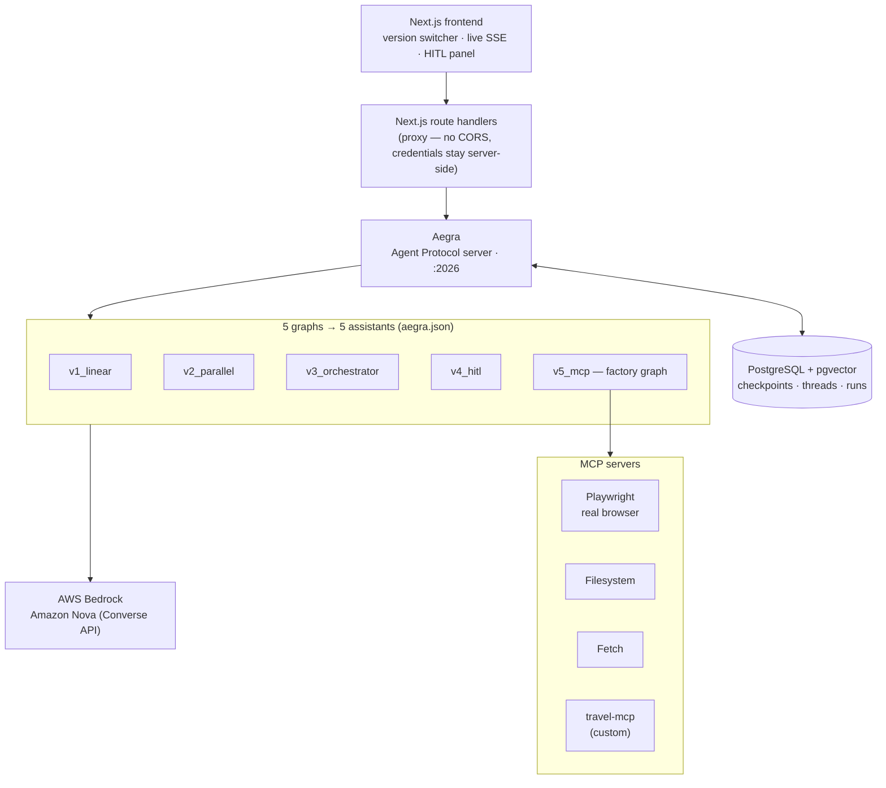
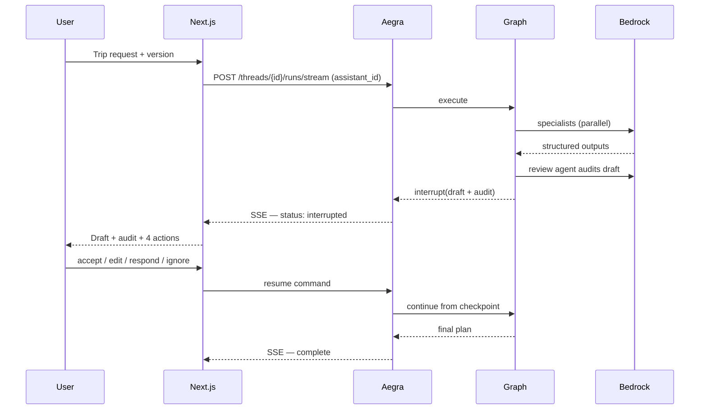

# Travel Planner Agent

**Five generations of the same multi-agent travel planner — linear, parallel, orchestrated, human-in-the-loop, and browser-automating — running side by side behind one [Aegra](https://github.com/aegra/aegra) server, switchable at runtime.**

`langgraph` · `aegra` · `agent-protocol` · `amazon-bedrock` · `amazon-nova` · `mcp` · `playwright` · `human-in-the-loop` · `nextjs` · `multi-agent`

> **Status: in active development.** Phase 0 of 11. See [docs/DEVELOPMENT_PLAN.md](docs/DEVELOPMENT_PLAN.md) for the full build plan. Benchmarks and the live demo link land in Phase 11 — this README will carry real measured numbers, never estimates.

---

## Why this exists

Most agent demos show you one architecture and assert it's the right one. This one
ships **five**, each a working system, each adding exactly one capability to the
last — so the trade-offs are visible rather than claimed. You can run the same trip
request through all five and watch what parallelism actually buys, what an
orchestrator actually fixes, and what a real browser actually costs.

All five are registered as separate graphs with a single Aegra server, so switching
version at runtime is one field in an API call — not a redeploy.

## The five versions

| Version | Architecture | Adds |
|---|---|---|
| **v1** `v1_linear` | Fixed sequential chain, 4 nodes | Baseline: shared state schema, Bedrock wiring, streaming, checkpointing |
| **v2** `v2_parallel` | Fan-out / fan-in DAG, 4 specialists | Concurrent branch execution, reducer-based state merging |
| **v3** `v3_orchestrator` | Fan-out + LLM orchestrator, 7 agents | Dynamic re-routing driven by a self-audit verdict |
| **v4** `v4_hitl` | v3 + `interrupt()` gate | Human approve / edit / respond / ignore, resume from checkpoint |
| **v5** `v5_mcp` | v4 + 4 MCP servers, factory graph | Real browser automation, per-run MCP session lifecycle |

## Architecture

**How a request flows.** The frontend picks a version, which selects an
`assistant_id`. Next.js route handlers proxy to Aegra so no credential ever
reaches the browser. Aegra persists the run, executes the corresponding LangGraph
graph, and streams events back as SSE. Graph state is checkpointed to PostgreSQL
after every node, which is what makes v4's mid-run pause survivable: the human can
walk away, and the run resumes from the exact checkpoint when they answer. v5's
graph is built per-run by a factory so its MCP browser sessions open and close with
the run rather than being shared across concurrent ones.

## Request flow — v4/v5 with the human-in-the-loop gate

## Tech stack

| Layer | Technology |
|---|---|
| Orchestration | LangGraph |
| Serving | Aegra (Agent Protocol), native — no Docker required |
| Models | AWS Bedrock — Amazon Nova Pro / Lite / Micro, tiered by agent role |
| Persistence | PostgreSQL 18 + pgvector |
| Tools | MCP — Playwright, Filesystem, Fetch, and a custom `travel-mcp` server |
| Frontend | Next.js 15 (App Router), React, `@langchain/langgraph-sdk` |
| Testing | pytest |

## Documentation

| Document | Contents |
|---|---|
| [DEVELOPMENT_PLAN.md](docs/DEVELOPMENT_PLAN.md) | Full build plan, phases, model strategy, risks |

`ARCHITECTURE.md`, `VERSIONS.md`, `AEGRA_DEPLOYMENT.md` and `MODELS.md` arrive with
the phases that produce them.

## Getting started

Setup instructions land in Phase 0 and are verified copy-paste before being
published here. Until then, [docs/DEVELOPMENT_PLAN.md](docs/DEVELOPMENT_PLAN.md)
describes the intended stack and layout.

## Safety boundary

v5 drives a real browser to search real availability and prices, and reports what
it finds. It never enters payment details and never clicks a final purchase button,
under any configuration. That is a deliberate boundary, not an unimplemented
feature.

## License

MIT
